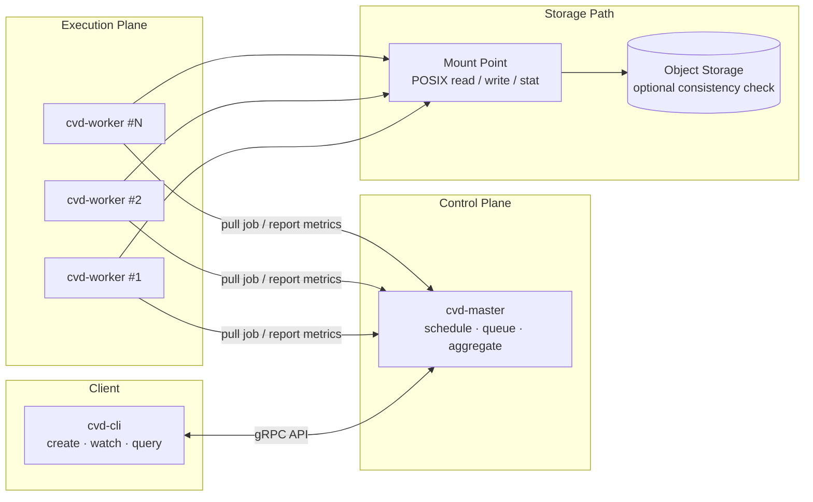

<div align="center">

# cvdbench

**面向 FUSE 与云对象存储用户态文件系统的分布式压测工具**

[](rust-toolchain.toml)
[](#许可证)
[](Cargo.toml)

</div>

---

## 概览

`cvdbench` 用于在真实挂载路径上验证用户态文件系统的吞吐、延迟、稳定性与一致性。它不是单机 I/O 小工具，而是面向多机、长稳、大规模数据集和元数据压力场景的 benchmark 框架。

**核心能力**

| 能力 | 说明 |
|---|---|
| 分布式调度 | `cvd-master` 统一调度任务，多个 `cvd-worker` 主动拉取并执行压测。 |
| 真实路径压测 | worker 直接通过 POSIX 文件接口访问 FUSE mount point。 |
| 多负载模型 | 支持 read、write、metadata 以及 mixed 组合压测。 |
| 清单驱动 | read 场景支持文件清单 CSV 或目录清单扫描，适合大规模数据集。 |
| 实时观测 | CLI 实时展示 worker 指标，并支持 JSON / CSV 结果导出。 |
| 一致性校验 | 可对比 FUSE 读取结果与 S3/BOS 源对象的 size / SHA256。 |
| 监控集成 | master 可暴露 Prometheus text endpoint。 |

**相关文档**

| 文档 | 内容 |
|---|---|
| [`spec.md`](spec.md) | 系统设计、协议、状态机、结果格式与约束。 |
| [`DEPLOY.md`](DEPLOY.md) | 编译分发、systemd、多机部署、监控和故障排查。 |
| [`examples/`](examples/) | master 配置与各类 job 模板。 |
| [`CONTRIBUTING.md`](CONTRIBUTING.md) | 开发与贡献说明。 |

---

## 架构

cvdbench 由三个进程组成：

| 组件 | 职责 |
|---|---|
| `cvd-master` | 保存 job 状态、分配 worker slot、扫描 manifest、聚合结果并暴露指标。 |
| `cvd-worker` | 常驻在压测机器上，主动向 master 拉取任务，在本机挂载点执行 workload。 |
| `cvd-cli` | 创建、观察、查询、取消和列出 job。 |



**设计约束**

- worker 到 master 的通信全部由 worker 主动发起，master 不回调 worker。
- worker 不监听端口，适合部署在没有入站端口的机器上。
- master 状态保存在内存中，master 重启后已提交 job 记录会丢失。
- worker ID 由 worker 自生成，格式为 `<hostname>-<pid>-<startup-uuid8>`。
- read 任务通过 master 维护的有界 file queue 分发文件，不做静态文件分片。

---

## 快速开始

### 环境要求

| 项目 | 要求 |
|---|---|
| 操作系统 | Linux x86_64 |
| Rust | 由 [`rust-toolchain.toml`](rust-toolchain.toml) 锁定 |
| Protobuf | `protoc` 3.12+ |
| 被测文件系统 | 每台 worker 使用相同的 `mount_point` 访问同一逻辑文件系统 |

### 1. 编译二进制

生产部署建议构建 musl 静态二进制，避免目标机器 glibc 版本差异：

```bash
rustup target add x86_64-unknown-linux-musl

RUSTFLAGS='-C target-feature=+crt-static' \
  cargo build --release --workspace --target x86_64-unknown-linux-musl
```

产物位于：

```text
target/x86_64-unknown-linux-musl/release/cvd-master
target/x86_64-unknown-linux-musl/release/cvd-worker
target/x86_64-unknown-linux-musl/release/cvd-cli
```

分发示例：

```bash
install -m 0755 target/x86_64-unknown-linux-musl/release/cvd-master /usr/local/bin/cvd-master
install -m 0755 target/x86_64-unknown-linux-musl/release/cvd-worker /usr/local/bin/cvd-worker
install -m 0755 target/x86_64-unknown-linux-musl/release/cvd-cli    /usr/local/bin/cvd-cli
```

### 2. 准备挂载点

所有 worker 需要通过一致的逻辑路径访问被测文件系统，例如：

```text
/mnt/examplefs
```

当 job 使用 `read.dir_manifest` 或 `metadata.dir_manifest` 时，master 也需要能访问清单扫描到的目录；如果只运行 `write` 或 `read.file_manifest`，master 只需要能读取配置文件和 manifest 文件本身。

manifest 内容中的文件或目录路径必须是相对 `mount_point` 的安全路径：

| 写法 | 结果 |
|---|---|
| `data/example/a.dat` | 正确，解析为 `/mnt/examplefs/data/example/a.dat`。 |
| `/data/example/a.dat` | 错误，绝对路径会被拒绝。 |
| `../a.dat` | 错误，包含路径逃逸会被拒绝。 |

### 3. 启动 master

创建配置文件：

```bash
install -d /etc/cvdbench
cat >/etc/cvdbench/cvd-master.toml <<'TOML'
[server]
listen = "0.0.0.0:9090"

[metrics]
listen = "0.0.0.0:9100"

[scheduler]
worker_staleness_secs = 60
job_retention_secs = 259200
prepare_timeout_secs = 600
start_delay_ms = 5000
file_queue_capacity = 100000
dir_queue_capacity = 50000
dir_scan_concurrency = 8

[[filesystems]]
name = "examplefs"
mount_point = "/mnt/examplefs"
TOML

cvd-master --config /etc/cvdbench/cvd-master.toml
```

确认监听：

```bash
ss -ltnp | grep 9090
```

### 4. 启动 worker

在每台压测机器上启动 worker：

```bash
cvd-worker --master <MASTER_IP>:9090
```

建议生产环境使用 systemd 常驻，并设置 `LimitNOFILE=65536`。如果 worker 依赖 FUSE 挂载点先就绪，可在 unit 中加入 `RequiresMountsFor=/mnt/examplefs`。完整模板见 [`DEPLOY.md`](DEPLOY.md)。

网络只要求 worker → master、CLI → master 能访问 `9090` 或 `[server].listen` 配置的端口；master 不回连 worker，worker 不需要开放入站端口。

### 5. 提交 job

复制最接近目标的示例并修改 `fs_name`、`target_workers`、`duration`、`concurrency`、目录和 manifest 路径：

```bash
cp examples/job_read.json /tmp/job_read.json

cvd-cli --master <MASTER_IP>:9090 create \
  --config /tmp/job_read.json \
  --output /tmp/cvdbench-result.json
```

`create` 默认会持续 watch 到终态；也可以单独查询：

```bash
cvd-cli --master <MASTER_IP>:9090 list --limit 10
cvd-cli --master <MASTER_IP>:9090 query <JOB_ID> --output result.json
```

---

## 命令参考

### `cvd-master`

```bash
cvd-master --config <CONFIG>
```

- 默认配置文件名为 `cvd-master.toml`。
- 启动 gRPC 服务和后台 watcher，用于 worker 活性检测与终态 job GC。
- 配置不支持热重载，变更配置需要重启 master。

### `cvd-worker`

```bash
cvd-worker --master <IP:PORT>
```

- 长驻 daemon，自动拉取 job、上报进度并回到空闲轮询。
- 支持自动重连。
- 不监听端口。

### `cvd-cli`

```bash
cvd-cli --master <IP:PORT> create --config job.json [--output result.json|.csv]
cvd-cli --master <IP:PORT> watch  <JOB_ID>
cvd-cli --master <IP:PORT> query  <JOB_ID> [--output result.json|.csv]
cvd-cli --master <IP:PORT> delete <JOB_ID>
cvd-cli --master <IP:PORT> list   [--status pending|preparing|running|completed|failed|cancelled] [--limit N]
```

终端模式会显示实时表格与终态摘要；`--output` 支持 JSON 和 CSV，格式说明见 [结果输出](#结果输出)。

---

## 测试场景

所有场景都使用同一条提交命令：

```bash
cvd-cli --master <MASTER_IP>:9090 create \
  --config examples/job_read.json \
  --output result.json
```

| 场景 | 目标 | 准备工作与示例 |
|---|---|---|
| 文件清单读 | 按 CSV 文件列表做顺序或随机读，统计吞吐、IOPS 和延迟。 | 配置 `read.file_manifest`，CSV 第一列为相对 `mount_point` 的 `fs_path`。示例：[`job_read.json`](examples/job_read.json) |
| 目录清单读 | master 扫描目录后分发文件给 worker 读取。 | 配置 `read.dir_manifest`，每行是相对 `mount_point` 的目录。示例：[`job_read_dir.json`](examples/job_read_dir.json) |
| 写入压测 | 多 worker 在独立目录下写文件，观察写吞吐、延迟和错误率。 | 配置 `write.dir`，按需启用 `fsync`、`cleanup`、`verify_after_write`。示例：[`job_write.json`](examples/job_write.json) |
| 元数据写入 | 预建目录树后循环执行 create、mkdir、stat、open、readdir。 | 配置 `metadata.read_only=false` 和目录树规模。示例：[`job_metadata.json`](examples/job_metadata.json) |
| 元数据只读 | 扫描已有目录树，循环执行只读元数据操作。 | 配置 `metadata.read_only=true`，建议设置 `read_only_scan_limit`。示例：[`job_metadata_readonly_examplefs_fuse.json`](examples/job_metadata_readonly_examplefs_fuse.json) |
| 一致性校验 | 对比 FUSE 文件和源对象的 size / SHA256。 | 配置 `read.s3_consistency_check` 和对象存储连接信息。示例：[`job_consistency.json`](examples/job_consistency.json) |
| Mixed 组合 | 在同一个 job 中并发执行 read、write、metadata。 | 同时配置多个 workload section。示例：自定义 |

### 常用字段

| 字段 | 说明 |
|---|---|
| `fs_name` | 引用 master 配置中的 `[[filesystems]].name`。 |
| `target_workers` | 期望参与本 job 的 worker 数。 |
| `duration` / `warmup` | 总运行时间和预热时间，统计窗口会排除 warmup。 |
| `concurrency` | 每个 worker、每类 workload 的并发度。 |
| `io_mode` | `seq` 或 `rand`。 |
| `io_aligned` | 是否按 `block_size` 对齐。 |
| `direct_io` | 使用 `O_DIRECT`，与 `io_aligned=false` 互斥。 |
| `rate_limit` | read/write 使用 `<size>/s`，metadata 使用 `<num>iops`。 |

### 单位格式

| 类型 | 示例 | 说明 |
|---|---|---|
| 时间 | `500ms`、`30s`、`5m`、`1h30m` | 支持串联。 |
| 大小 | `4Ki`、`1Mi`、`10G`、`1024` | `K/M/G/T` 为十进制，`Ki/Mi/Gi/Ti` 为二进制，无单位视为字节。 |
| 速率 | `1GB/s`、`500MiB/s`、`10000iops` | throughput 用于 read/write，IOPS 用于 metadata。 |

---

## Manifest 格式

### `file_manifest.csv`

CSV 第一列为 `fs_path`，第二列 `s3_key` 可选，用于一致性校验：

```csv
fs_path,s3_key
data/example/file001.dat,objects/file001.dat
data/example/file002.dat,objects/file002.dat
```

### `dir_manifest.txt`

每行一个相对 `mount_point` 的目录：

```text
data/example/dataset-a
data/example/dataset-b
```

> `file_manifest` 当前会一次性读入内存再解析。超大 CSV 建议先切分或抽样，避免 master 内存压力过大。

---

## 结果输出

`cvd-cli create / query --output` 支持 JSON 和 CSV：

```bash
cvd-cli --master <MASTER_IP>:9090 query <JOB_ID> --output result.json
cvd-cli --master <MASTER_IP>:9090 query <JOB_ID> --output result.csv
```

JSON 顶层结构：

| 字段 | 说明 |
|---|---|
| `job_id` | UUID v4。 |
| `status` | 小写状态：`completed`、`failed`、`cancelled` 等。 |
| `created_at_ms` | 创建时间，Unix milliseconds。 |
| `duration_secs` | job 配置中的运行时长，单位秒。 |
| `effective_duration_secs` | 各 worker 有效统计窗口交集。 |
| `target_workers` / `run_workers` | 目标 worker 数与实际运行 worker 数。 |
| `window_misaligned` | 统计窗口无法完全对齐时为 `true`。 |
| `spec` | 已脱敏的 BenchSpec。 |
| `aggregated` | 聚合吞吐、IOPS、错误率、延迟直方图与 per-op 指标。 |
| `workers` | 每个 worker 的执行结果和 per-op 明细。 |

CSV 每行表示一个 `(worker_id, op)` 指标；`worker_id="*"` 表示聚合行。

---

## 监控

master 可通过 `[metrics].listen` 暴露 Prometheus text endpoint，例如：

```text
cvdbench_worker_op_throughput_mbps{job_id="...",worker_id="...",op="read"} 293.6
cvdbench_worker_op_latency_us{job_id="...",worker_id="...",op="read.open",stat="p99"} 1234
```

注意：cvdbench 只暴露 workload 指标，不内建 master、worker 或 FUSE 进程的 CPU、RSS、fd、thread 采集。生产环境建议配合 node_exporter、process-exporter 或 cAdvisor，并按 `instance`、`process_name` 或容器 label 与 job 时间窗口关联。

---

## 开发

```bash
cargo test --workspace
cargo clippy --workspace
```

Workspace 结构：

| Crate | 说明 |
|---|---|
| `crates/cvd-proto` | gRPC / protobuf 定义与生成代码。 |
| `crates/cvd-common` | 通用配置、类型、指标和工具函数。 |
| `crates/cvd-master` | master 调度与聚合服务。 |
| `crates/cvd-worker` | worker 执行引擎。 |
| `crates/cvd-cli` | 命令行客户端与结果展示。 |

---

## 部署

生产部署请优先阅读 [`DEPLOY.md`](DEPLOY.md)，其中包含：

- Linux、protoc、musl 静态产物等系统要求。
- master / worker 的 systemd unit 模板。
- 多机部署清单。
- Prometheus 监控接入。
- 升级、重启、容量规划与故障排查。

---

## 许可证

本项目采用 Apache-2.0 许可证。
