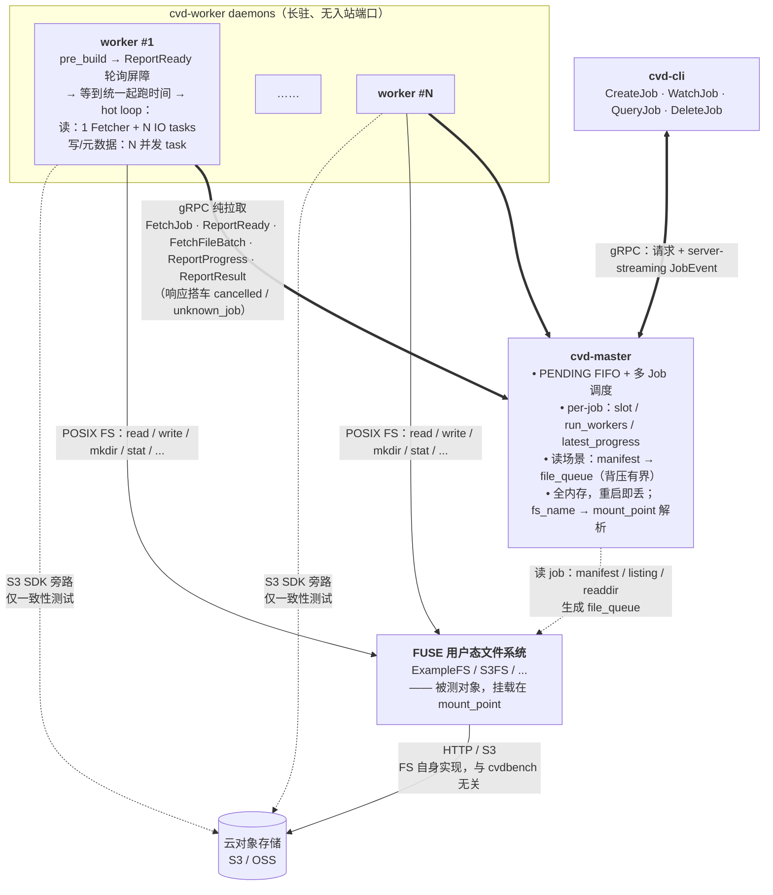

# cvdbench

cvdbench 是一个面向 **FUSE + 云对象存储用户态文件系统**（例如 ExampleFS、S3FS）的分布式压测工具。它关注的不只是峰值吞吐，还包括大规模数据集、长时间运行、客户端资源占用和稳定性。

相比通用 I/O 压测工具，cvdbench 更适合验证这类文件系统在真实挂载路径上的表现：多机 worker 同时访问同一个 FUSE mount，master 负责调度、分发文件清单并聚合结果，CLI 负责提交任务和查看进度。

- 设计细节与约束：[`spec.md`](spec.md)
- 部署、systemd、监控：[`DEPLOY.md`](DEPLOY.md)
- 示例 job：[`examples/`](examples/)

---

## 系统架构

cvdbench 由三个进程组成：

- `cvd-master`：中心调度服务，保存 job 状态、分配 worker slot、扫描 manifest、聚合结果。
- `cvd-worker`：长驻压测进程，主动从 master 拉取任务，在本机挂载点执行读写或 metadata 操作。
- `cvd-cli`：命令行客户端，用于创建、观察、查询、取消和列出 job。

所有 worker 到 master 的通信都是 **worker 主动发起的 gRPC 请求**。master 不需要知道 worker 的监听地址，也不会回调 worker，因此 worker 可以运行在没有入站端口的机器上。



核心设计约束：

- **Master 不回调 worker**：取消、unknown job、起跑时间等控制信号都通过 worker 请求的响应返回。
- **Master 状态保存在内存中**：master 重启后，已提交 job 的状态会丢失。
- **Worker ID 由 worker 自生成**：格式为 `<hostname>-<pid>-<startup-uuid8>`，在进程生命周期内保持不变。
- **读任务通过共享队列分发文件**：master 维护有界 file queue，worker 竞争拉取文件批次，不做静态文件分片。

更完整的调度状态机和 RPC 语义见 [`spec.md`](spec.md) §2 / §5 / §6。

---

## 快速开始

以下步骤展示如何在多机环境中启动一次压测。生产环境的 systemd unit、监控接入和升级注意事项见 [`DEPLOY.md`](DEPLOY.md)。

环境要求：Linux x86_64、Rust stable（由 `rust-toolchain.toml` 锁定）以及 protoc 3.12+。

### 1. 编译并分发二进制

生产部署要求二进制不依赖目标机 glibc 版本，建议使用 musl target 生成静态二进制。
当前仓库没有单独的 build 脚本自动切换 musl；需要显式安装 target 并传入
`--target x86_64-unknown-linux-musl`。普通 `cargo build --release --workspace`
适合本机开发验证，但产物通常仍会依赖构建机 glibc，不建议直接分发到异构集群。

```bash
rustup target add x86_64-unknown-linux-musl

RUSTFLAGS='-C target-feature=+crt-static' \
  cargo build --release --workspace --target x86_64-unknown-linux-musl

# 生成 target/x86_64-unknown-linux-musl/release/{cvd-master,cvd-worker,cvd-cli}
```

把三个二进制复制到集群机器，例如：

```bash
install -m 0755 target/x86_64-unknown-linux-musl/release/cvd-master /usr/local/bin/cvd-master   # master 机器
install -m 0755 target/x86_64-unknown-linux-musl/release/cvd-worker /usr/local/bin/cvd-worker   # 每台 worker 机器
install -m 0755 target/x86_64-unknown-linux-musl/release/cvd-cli    /usr/local/bin/cvd-cli      # 任意客户端机器
```

可以用 `ldd` 做一次确认；静态 musl 产物通常会显示 `not a dynamic executable`：

```bash
ldd target/x86_64-unknown-linux-musl/release/cvd-worker
```

### 2. 准备被测文件系统挂载

每台 worker 都必须能通过同一个逻辑路径访问被测文件系统。涉及
`read.dir_manifest` / `metadata.dir_manifest` 时，master 也需要能访问这些
manifest 会扫描到的目录；如果只跑 `write` 或 `read.file_manifest`，master
只需要访问配置文件和 manifest 文件本身。

```bash
# 示例：所有参与机器都挂到相同路径
mount.examplefs ... /mnt/fuse_filesystem
```

### 3. 配置并启动 master

master 配置只在 master 机器上读取。`fs_name` 是 job 里引用的名字，`mount_point`
必须是 master/worker 都一致使用的绝对挂载路径；尽量避免不同机器用不同
symlink 路径指向同一挂载。

```bash
install -d /etc/cvdbench
cat >/etc/cvdbench/cvd-master.toml <<'TOML'
[server]
listen = "0.0.0.0:9090"

[metrics]
listen = "0.0.0.0:9100"

[scheduler]
worker_staleness_secs = 60
job_retention_secs = 259200
prepare_timeout_secs = 600
start_delay_ms = 5000
file_queue_capacity = 100000
dir_queue_capacity = 50000
dir_scan_concurrency = 8

[[filesystems]]
name = "fusefs"
mount_point = "/mnt/fuse_filesystem"
TOML

cvd-master --config /etc/cvdbench/cvd-master.toml
```

确认 master 监听端口：

```bash
ss -ltnp | grep 9090
```

### 4. 启动 worker

在每台 worker 机器上启动一个或多个 worker 进程。worker 不监听端口，只主动连接
master。

```bash
cvd-worker --master <MASTER_IP>:9090
```

建议用 systemd 常驻，并设置 `LimitNOFILE=65536`；如果 worker 依赖 FUSE
挂载点先就绪，可以在 unit 中加 `RequiresMountsFor=/mnt/fuse_filesystem`。
模板见 DEPLOY.md。

网络连通性要求：worker → master、CLI → master 都必须能访问 `9090`（或
`[server].listen` 配置的端口）；master 不回连 worker，worker 不需要开放端口。

### 5. 准备 manifest 或 job 配置

manifest 文件路径是 master 本机路径；默认建议放在被测挂载点下：
`/${mount_point}/data/example/cvdbench/dir_manifest/cvd-dir-manifest.txt`
和 `/${mount_point}/data/example/cvdbench/file_manifest/cvd-file-manifest.csv`。
manifest **内容**里的文件/目录路径必须是相对 `mount_point` 的安全路径，不能
以 `/` 开头。

```text
# 正确：相对 /mnt/fuse_filesystem
data/example/datasets/a

# 错误：绝对路径，会被 path_safe 拒绝
/data/example/datasets/a
```

job 里的 `fs_name` 必须匹配 master 配置中的 `[[filesystems]].name`。
可以从 [`examples/job_metadata.json`](examples/job_metadata.json) 或
[`examples/job_read_dir.json`](examples/job_read_dir.json) 开始，按实际环境替换
`fs_name`、目录和 manifest 路径。

### 6. 提交压测并查看结果

```bash
cvd-cli --master <MASTER_IP>:9090 create \
  --config job.json \
  --output result.json

cvd-cli --master <MASTER_IP>:9090 list --limit 10
cvd-cli --master <MASTER_IP>:9090 query <JOB_ID> --output result.json
```

`cvd-cli create` 默认在 CreateJob 后自动 watch 进度直到终态，并把结果写入
`result.json`（或 `--output result.csv` 输出 CSV）；不指定 `--output` 时默认写
`{job_id}.json`。

---

## 命令参考

### `cvd-master`

```bash
cvd-master --config <CONFIG>     # 配置文件路径，默认 cvd-master.toml
```

启动 gRPC 服务 + 后台 watcher（staleness / GC）；详细配置项见
[`examples/cvd-master.toml`](examples/cvd-master.toml) 与 spec §5.1 / §9.9。

### `cvd-worker`

```bash
cvd-worker --master <IP:PORT>    # master 地址
```

长驻 daemon。FetchJob 轮询、自动重连、SIGINT/SIGTERM 干净退出。**不监听端口**。

### `cvd-cli`

```bash
cvd-cli --master <IP:PORT> create  --config job.json [--output result.json|.csv]
cvd-cli --master <IP:PORT> watch   <JOB_ID>
cvd-cli --master <IP:PORT> query   <JOB_ID> [--output result.json|.csv]
cvd-cli --master <IP:PORT> delete  <JOB_ID>
cvd-cli --master <IP:PORT> list    [--status pending|preparing|running|completed|failed|cancelled] [--limit N]
```

`create` 之后默认 stream 进度直到终态，终端模式会显示 live table 和终态摘要：

```
created job 539693c6-...
(streaming events; press Ctrl+C to detach or cancel)
Job ID: 539693c6-... | Elapsed: 00:00:58 / 00:01:00 | Status: RUNNING

   Worker    │      Op       │  Elapsed  │ Throughput │  Ops/s  │   Ops    │ Errors │  p50   │  p95   │  p99   │  p999  │  max   │  avg
─────────────┼───────────────┼───────────┼────────────┼─────────┼──────────┼────────┼────────┼────────┼────────┼────────┼────────┼────────
  node-1234  │     read      │    58s    │  1.01G/s   │  1194   │  70.9K   │   0    │  21ms  │ 157ms  │ 243ms  │ 356ms  │ 1141ms │  48ms
  Aggregate  │     read      │    58s    │  1.01G/s   │  1194   │  70.9K   │   0    │  21ms  │ 157ms  │ 243ms  │ 356ms  │ 1141ms │  48ms

Job Summary
───────────
Job ID  : 539693c6-...
Status  : COMPLETED
Workers : 4 reported, 4 success, 0 failed
```

输出文件按 spec §9.3 格式（status 小写字符串、`duration_secs` 浮点秒、
`window_misaligned` 等顶层字段、`spec.read.s3_consistency_check` 凭据脱敏为
`"***"`、`workers[]` 摊平 per_op）。

---

## 测试场景概览

先选一个最接近目标的 case，复制对应 `examples/job_*.json`，再按环境修改
`fs_name`、`target_workers`、`duration`、`concurrency`、manifest 路径和目录路径。
所有 job 都通过同一条命令提交：

```bash
cvd-cli --master <MASTER_IP>:9090 create \
  --config examples/job_read.json \
  --output result.json
```

| Case | 目标 | 适用场景 | 需要准备 | 示例 |
|---|---|---|---|---|
| 读吞吐/延迟（文件清单） | 按 CSV 中的文件列表做顺序或随机读，统计吞吐、IOPS、延迟 | 已有一批明确文件，想稳定复现同一工作集 | `read.file_manifest` 默认指向 `/${mount_point}/data/example/cvdbench/file_manifest/cvd-file-manifest.csv`；CSV 第一列是相对 `mount_point` 的 `fs_path` | [`examples/job_read.json`](examples/job_read.json) |
| 读吞吐/延迟（目录清单） | master 先扫描目录清单，再把文件分发给 worker 读取 | 文件很多，不想提前生成完整文件 CSV | `read.dir_manifest` 默认指向 `/${mount_point}/data/example/cvdbench/dir_manifest/cvd-dir-manifest.txt`；每行是相对 `mount_point` 的目录 | [`examples/job_read_dir.json`](examples/job_read_dir.json) |
| 写入稳定性 | 多 worker 在独立目录下写文件，观察写吞吐、延迟、错误率 | 验证 FUSE 写路径、flush/fsync、清理逻辑或长稳 | `write.dir` 是相对 `mount_point` 的目录；按需打开 `fsync` / `verify_after_write` / `cleanup` | [`examples/job_write.json`](examples/job_write.json) |
| 元数据写入型 | 预建目录树后循环执行 `create` / `mkdir` / `stat` / `open` / `readdir` | 验证 namespace 操作、inode/dentry 压力、元数据服务稳定性 | `metadata.dir` 是相对 `mount_point` 的测试目录；调小/调大 `depth`、`width`、`files_per_dir` 控制规模 | [`examples/job_metadata.json`](examples/job_metadata.json) |
| 元数据只读扫描 | worker 扫描已有目录树并循环执行只读元数据操作 | 不希望创建/删除文件，只想压已有目录树 | `metadata.read_only=true`；`metadata.dir` 指向已有目录；建议设置 `read_only_scan_limit` | [`examples/job_metadata_readonly_examplefs_fuse.json`](examples/job_metadata_readonly_examplefs_fuse.json) |
| FS-vs-S3/BOS 一致性 | worker 同时读 FUSE 文件和对象存储对象，比对 size / SHA256 | 验证 FUSE 读到的数据是否与源对象一致 | `read.file_manifest`；S3/BOS bucket、endpoint、region、凭据和可选 `prefix` | [`examples/job_consistency.json`](examples/job_consistency.json) |
| Mixed 组合压测 | 同一个 job 内并发运行 read / write / metadata runner | 模拟真实业务混合负载 | 在同一个 job JSON 中同时配置 `read`、`write`、`metadata` 中的多个 section | 参考下方 Mixed 说明 |

常用调参入口：

- `target_workers`：期望参与本 job 的 worker 数；小于等于 0 会按 1 处理。
- `duration` / `warmup`：总运行时间和预热时间；统计窗口会排除 warmup。
- `concurrency`：每个 worker、每类 workload 的并发度；mixed job 中各 section 独立生效。
- `block_size` / `io_mode` / `direct_io`：控制读写 I/O 形态；`direct_io=true` 要求对齐访问。
- `rate_limit` / `think_time`：限制单 worker 的压力，适合长稳或逐步加压。

如果只想做部署连通性验证，优先用 [`examples/job_metadata.json`](examples/job_metadata.json)
并把 `duration`、`target_workers` 和 `metadata.concurrency` 调小；如果要验证读路径，
先准备一个很小的 `read.file_manifest`，确认路径规则正确后再扩大规模。

### 场景示例

**1）最小连通性验证：metadata 写入型**

```bash
cp examples/job_metadata.json /tmp/job_smoke.json
# 编辑 /tmp/job_smoke.json：fs_name 改成 master 配置里的名字，例如 fusefs；
# 可把 target_workers=1、duration="30s"、metadata.concurrency=1 降低压力。

cvd-cli --master <MASTER_IP>:9090 create \
  --config /tmp/job_smoke.json \
  --output /tmp/cvd-smoke-result.json
```

**2）读文件清单：固定工作集复测**

```bash
install -d /mnt/fuse_filesystem/data/example/cvdbench/file_manifest
cat >/mnt/fuse_filesystem/data/example/cvdbench/file_manifest/cvd-file-manifest.csv <<'CSV'
bench/data/file001.dat
bench/data/file002.dat
CSV

cp examples/job_read.json /tmp/job_read.json
# 编辑 /tmp/job_read.json：fs_name=fusefs，read.file_manifest=/mnt/fuse_filesystem/data/example/cvdbench/file_manifest/cvd-file-manifest.csv。

cvd-cli --master <MASTER_IP>:9090 create \
  --config /tmp/job_read.json \
  --output /tmp/cvd-read-result.json
```

**3）读目录清单：让 master 扫描目录**

```bash
install -d /mnt/fuse_filesystem/data/example/cvdbench/dir_manifest
cat >/mnt/fuse_filesystem/data/example/cvdbench/dir_manifest/cvd-dir-manifest.txt <<'TXT'
bench/data
bench/archive
TXT

cp examples/job_read_dir.json /tmp/job_read_dir.json
# 编辑 /tmp/job_read_dir.json：fs_name=fusefs，read.dir_manifest=/mnt/fuse_filesystem/data/example/cvdbench/dir_manifest/cvd-dir-manifest.txt。

cvd-cli --master <MASTER_IP>:9090 create \
  --config /tmp/job_read_dir.json \
  --output /tmp/cvd-read-dir-result.json
```

上面 manifest 内容里的 `bench/data`、`bench/data/file001.dat` 都是相对路径；
如果 master 配置 `mount_point = "/mnt/fuse_filesystem"`，实际访问的是
`/mnt/fuse_filesystem/bench/data/...`。

---

## Job 配置速查

详细字段在 spec §3 / §4.1 / §9.4。压测类型由 `cvdbench` 下的
`read` / `write` / `metadata` 子对象决定；可以只配置其中一个，也可以组合成
mixed job。

### Read

| 场景 | 关键字段 | 说明 | 示例 |
|---|---|---|---|
| 文件清单读 | `read.file_manifest` | 从 CSV 清单读取文件；CSV 第一列 `fs_path` 必填，第二列 `s3_key` 可选。 | [`examples/job_read.json`](examples/job_read.json) |
| 目录清单读 | `read.dir_manifest` | master 扫描目录清单并把发现的文件分发给 worker。 | [`examples/job_read_dir.json`](examples/job_read_dir.json) |
| FS-vs-S3/BOS 一致性 | `read.file_manifest` + `read.s3_consistency_check` | worker 读 FS 文件，同时用 S3 SDK 读对象并比对 size / SHA256。 | [`examples/job_consistency.json`](examples/job_consistency.json) |

`read.file_manifest` 与 `read.dir_manifest` **二选一**。manifest 路径本身可以是
master 本机上的绝对路径（如 `/tmp/files.csv`），但 manifest 内容里的 `fs_path`
/ 目录项必须是相对 `mount_point` 的安全路径：不能以 `/` 开头，不能包含 `..`
或 NUL。示例：master 配置 `mount_point = "/mnt/fuse_filesystem"` 时，manifest
中写 `data/example/a.dat`，实际访问
`/mnt/fuse_filesystem/data/example/a.dat`。

> 注意：当前 `file_manifest` reader 会把 CSV 一次性读入内存再解析；超大 CSV
> 建议先切分或抽样，避免 master 内存压力过大。

### Write

| 场景 | 关键字段 | 说明 | 示例 |
|---|---|---|---|
| 写文件 | `write` | worker 在 `write.dir/{worker_id}/{job_id}/` 下写入文件；支持固定大小或大小范围。 | [`examples/job_write.json`](examples/job_write.json) |

`write.file_size` 与 `write.file_size_range` 二选一；可选 `fsync`、`cleanup`、
`verify_after_write`。`verify_after_write=true` 时会写后读回校验内容。

### Metadata

| 场景 | 关键字段 | 支持操作 | 说明 | 示例 |
|---|---|---|---|---|
| 写入型 metadata | `metadata.read_only=false` | `create` / `mkdir` / `stat` / `open` / `readdir` | worker 预建独立目录树后循环执行元数据操作。 | [`examples/job_metadata.json`](examples/job_metadata.json) |
| 只读 metadata（扫描目录树） | `metadata.read_only=true`，不配置 `metadata.dir_manifest` | `stat` / `open` / `readdir` | 每个 worker 独立扫描同一个 `metadata.dir` 作为工作集，不创建/清理文件。 | [`examples/job_metadata_readonly_examplefs_fuse.json`](examples/job_metadata_readonly_examplefs_fuse.json) |
| 只读 metadata（目录清单） | `metadata.read_only=true` + `metadata.dir_manifest` | 仅 `stat` | master 根据目录清单扫描并分发路径；当前实现只支持 `metadata.stat`。 | — |

`metadata.dir` 是相对 `mount_point` 的安全路径。只读扫描模式建议设置
`read_only_scan_limit`，避免 PREPARING 阶段扫描过久。多 worker 使用同一个
`metadata.dir` 时，每个 worker 都会独立扫描该目录树；worker 之间不做自动分片，
可能访问同一批目录或文件。

### Mixed

`read` / `write` / `metadata` 可以任意组合：

- `read + write`
- `read + metadata`
- `write + metadata`
- `read + write + metadata`

mixed job 会并发运行已配置的 runner，各场景各自按 `concurrency` 驱动，整体比例由
各 section 的并发数和操作耗时共同决定。

### 通用字段与单位

- `io_mode`: `seq` / `rand`
- `io_aligned`: `true` 表示按 `block_size` 对齐；`false` 表示非对齐访问，read
  会按文件路径和长度生成确定性随机起始 offset
- `direct_io`: 使用 `O_DIRECT`；与 `io_aligned=false` 互斥，并要求 block / buffer
  满足对齐约束
- duration / think_time：`<num>(h|m|s|ms)` 串联，如 `1h30m`、`500ms`
- size / block_size / file_size：`<num>(K|M|G|T|Ki|Mi|Gi|Ti|B)`，
  `1K=1000`、`1Ki=1024`，无单位视为字节
- rate_limit：read/write 使用 `<size>/s`（per-worker throughput），metadata 使用
  `<num>iops`（per-worker IOPS）

---

## 输出文件格式

参见 spec §9.3。`cvd-cli create / query --output file.json` 写 JSON，
`--output file.csv` 写 CSV。

JSON 顶层字段：

| 字段 | 类型 | 说明 |
|---|---|---|
| `job_id` | string | UUID v4 |
| `status` | string（`completed` / `failed` / `cancelled` / ...） | spec §9.3 小写 |
| `created_at_ms` | i64 | 创建时刻 unix ms |
| `error` | string?（仅 FAILED） | 来自首个失败 worker |
| `duration_secs` | f64 | spec.duration 解析 |
| `effective_duration_secs` | f64 | 各 worker `[measure_start, measure_end]` 交集 |
| `target_workers` / `run_workers` | i32 / usize | spec §5.4 调度参数 |
| `window_misaligned` | bool | 真则 effective_duration_secs 是兜底值 |
| `spec` | object | 已脱敏的 BenchSpec |
| `aggregated.{throughput_mbps, iops, total_ops, total_bytes, errors, error_rate, latency_us, per_op}` | object | spec §4.2 聚合规则 |
| `workers[].{worker_id, success, error, effective_duration_ms, measure_start_ms, measure_end_ms, consistency_errors, per_op}` | array | 每个 worker 单独的明细 |

CSV：每行一个 `(worker_id, op)` 对；`worker_id="*"` 表示聚合：

```csv
worker_id,op,success,total_ops,total_bytes,errors,throughput_mbps,iops,p50_us,p95_us,p99_us,p999_us,max_us,avg_us,effective_duration_ms
*,*,true,189984,1556348928,0,1556.35,189984.0,9,20,28,50,359,10.7,1000
*,read,true,189984,1556348928,0,1556.35,189984.0,9,20,28,50,359,10.7,1000
node12-3941-7af2c910,read,true,112366,920502272,0,920.50,112366.0,9,20,29,50,174,10.8,1000
node13-3941-9c1ef8a3,read,true,77618,635846656,0,635.85,77618.0,9,20,28,50,359,10.7,1000
```

---

## 进程资源监控

cvd-master 可通过 `[metrics].listen` 暴露 Prometheus text endpoint（默认示例
`0.0.0.0:9100`），内容来自 master 已收到的 worker `ReportProgress.per_op`：

```text
cvdbench_worker_op_throughput_mbps{job_id="...",worker_id="...",op="read"} 293.6
cvdbench_worker_op_latency_us{job_id="...",worker_id="...",op="read.open",stat="p99"} 1234
```

它覆盖的是 cvdbench workload I/O 指标；cvdbench **不内建** master / worker /
FUSE 进程的 CPU / RSS / fd / thread 采集（spec §6.8 / §9 ）。请用
node_exporter / process-exporter / cAdvisor + Prometheus，按 `instance` /
`process_name` / 容器 label 关联 cvdbench job 时间窗口。

`worker_last_seen` 仅用于 master 的活性判定与终态决议，不是资源监控指标。

---

## 部署

见 [`DEPLOY.md`](DEPLOY.md)：

- 编译要求（Linux 5.4+、x86_64、protoc、musl 静态产物避免依赖 glibc）
- master / worker systemd unit 模板
- 多机部署清单
- 监控接入
- 升级 / 重启注意事项（spec §9.9：配置不支持热重载，重启即丢 job 记录）

---

## 测试

```bash
cargo test --workspace
cargo clippy --workspace
```

---

## 许可证

Apache-2.0。
