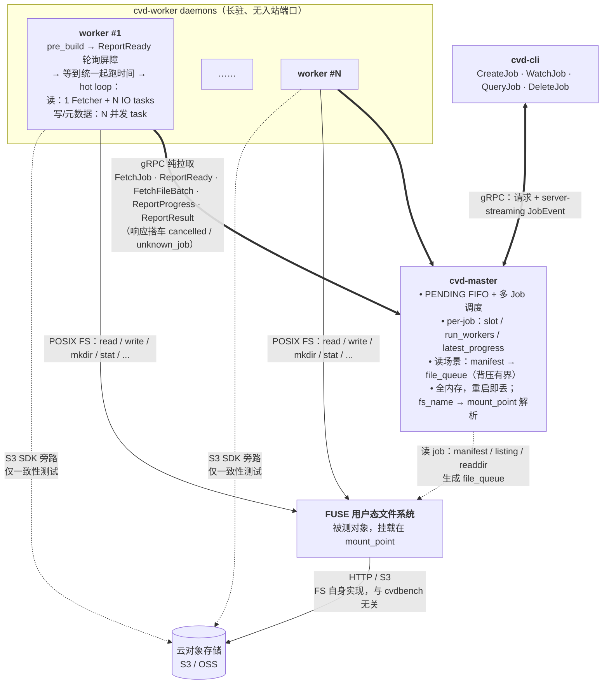
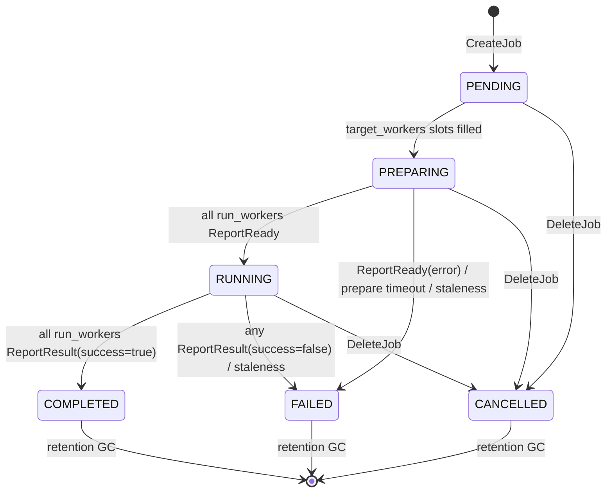

# CVDBench 系统设计 Spec

## 项目背景

cvdbench 是针对基于 FUSE + 云对象存储的用户态文件系统的压测服务，补充 vdbench、fio 等工具在此类场景下的不足。目标不仅是评估文件系统的功能和性能，更重要的是验证文件系统客户端在大规模数据量、长时间连续压测下的资源占用和运行稳定性。

---

## 一、项目结构（Cargo Workspace）

```
cvdbench/
├── Cargo.toml
├── proto/
│   └── master.proto         # 唯一协议文件：CLI ↔ Master + Worker ↔ Master
├── crates/
│   ├── cvd-proto/           # protobuf 生成代码（build.rs + tonic）
│   ├── cvd-common/          # 共享类型：BenchSpec, Metrics, Error 等
│   ├── cvd-cli/             # 命令行工具（gRPC client）
│   ├── cvd-master/          # 中心控制服务（gRPC server）
│   └── cvd-worker/          # 压测执行服务（gRPC client only，无 server）
└── spec.md
```

---

## 二、架构概述

cvdbench 整体采用分布式 Master-Worker 架构，由三个模块组成：

- **cvd-cli**：命令行工具，向 Master 提交/查询/删除压测任务
- **cvd-master**：中心控制服务，维护任务状态，为 Worker 分发文件批次，汇聚结果
- **cvd-worker**：压测执行服务，纯 gRPC client，主动向 Master 拉取任务和文件批次并执行压测

**整体架构（High-Level）：**



> 图中实线表示常规控制流或数据访问路径，虚线表示只在特定场景启用的路径。Worker 是纯 gRPC client，主动向 master 拉取 job 和文件批次；master 不回调 worker，也没有 WorkerService。读 job 中 master 根据 file_manifest 或 dir_manifest 生成 file_queue；dir_manifest 模式会扫描目录，因此会对被测文件系统产生额外元数据压力。一致性测试时 worker 通过 S3 SDK 旁路直访云存储，与 FS 自身访问对象存储的路径解耦。FUSE、cvd-master、cvd-worker 等进程资源统一由 node_exporter / process-exporter / cAdvisor 等外部监控系统采集，cvdbench 不内建进程资源监控。

**关键设计决策：**

| 决策点 | 结论 |
|--------|------|
| 实现语言 | Rust |
| 架构模式 | Master-Worker 纯拉取模型：Worker 主动向 Master 拉取任务，Master 无需管理 Worker 集群，无注册、无 WorkerService |
| Worker 通信 | Worker 是纯 gRPC client，只调用 Master 的接口；Master 不回调 Worker；取消、活性等反向信号搭车在 RPC 响应中 |
| Job 执行 | 所有 Worker 启动后轮询 `FetchJob`；每个 PENDING job 持有 `target_workers` 个 slot（省略或 `0` 归一化为 `1`），worker 拉到 job 即占走一个 slot；slot 占满后进入 PREPARING；全部 worker `ReportReady` 后进入统一起跑阶段并转为 RUNNING；任一准备失败、执行失败或失联均使 job FAILED |
| 多 Job 调度 | Master 维护 PENDING job FIFO 队列；同一时刻只有队首 job 接收 FetchJob 占 slot，队首关闭报名后从队列移出，下一 job 上位；避免单个大 job 占满集群、后续 job 饥饿 |
| 起跑同步 | Worker 完成本地准备后通过 `ReportReady` 参与起跑屏障；所有 worker ready 前，`ReportReadyResponse.start_at_ms=0`；全部 ready 后，Master 在 `ReportReadyResponse.start_at_ms` 返回统一起跑时间，worker 等到该时间再进入 hot loop；warmup 与 duration 在共同时间轴上度量 |
| Worker 活性 | Master 通过 worker 发起的任意有效 RPC 刷新 `last_seen`；RUNNING/PREPARING worker 超过 staleness 阈值（默认 60s 未上报）即判定 job FAILED |
| 读场景文件来源 | 支持两种互斥形式：`file_manifest` 是文件列表（CSV：`fs_path,s3_key`），master 直接解析后放入 file_queue；`dir_manifest` 是目录列表（每行一个目录），master 扫描目录枚举文件后放入 file_queue |
| 读场景并发设计 | Worker 内部：1 个 Fetcher task 专职拉批次 + N 个 I/O task 专职执行读操作，流水线解耦 |
| 写/元数据场景 | Worker 完全自治：收到 job spec 后在 `{dir}/{worker_id}/{job_id}/` 下自建目录树和数据，无需 FetchFileBatch；跨 job 复用时不会互相残留 |
| 一致性测试 | 读场景：FS 读 vs S3 SDK 读 hash 对比；写场景可选 `verify_after_write` 写后读 checksum 校验 |
| 错误处理 | **Fail-fast**：worker 内任意 op 失败（含 metadata 并发 ENOENT/EEXIST、FS vs S3 不一致）立即停止本地执行并 `ReportResult(success=false)`；任一 worker 失败使整个 job 进入 FAILED |
| 指标汇聚 | 指 Master 如何把多个 worker 的结果合成为一个 job 结果：累计型指标（`total_bytes`、`total_ops`、`error_count`）按成功 worker 求和；吞吐/IOPS 不平均各 worker 数值，而是用总 bytes/ops 除以统一有效计量窗口重新计算；延迟不平均 p99，而是合并各 worker 上报的 HDR histogram 后重新计算 p50/p95/p99/p999，避免分位数失真（详见 §4.2） |
| 进程资源监控 | 统一交给 node_exporter / process-exporter / cAdvisor 等外部监控系统；cvdbench 不内建采集 FUSE、master、worker 的 CPU/RSS/fd/thread 等进程资源指标 |
| 结果持久化 | 纯内存，不持久化；Master 重启 = 所有 job 记录丢失，worker 后续收到 `unknown_job` 并放弃当前 job；已完成 job 默认保留 3 天后 GC |
| 部署环境 | Linux（Debian/Ubuntu），内核 5.4+，独立进程部署 |

---

## 三、Job Template（完整定义）

```json
{
  "cvdbench": {
    "fs_name": "examplefs",
    "target_workers": 4,             // 期望参与本 job 的 worker 数；省略或 0 会归一化为 1

    "io_mode": "seq",
    "io_aligned": true,
    "direct_io": false,              // O_DIRECT 与 io_aligned=false 互斥，CreateJob 时拒绝
    "block_size": "1M",
    "duration": "1h",
    "warmup": "5m",

    "read": {
      "concurrency": 16,
      "file_manifest": "manifests/read.csv", // 与 dir_manifest 互斥；文件列表 CSV 路径："fs_path,s3_key"
      "dir_manifest": "",            // 与 file_manifest 互斥；目录列表文件路径，每行一个目录
      "think_time": "10ms",
      "rate_limit": "1GB/s",         // per-worker 限速；如需全局限速请相应缩小
      "loop_files": false,           // duration 未到但文件耗尽时是否循环复读 manifest
      "s3_consistency_check": {
        "bucket_name": "example-bucket",
        "bucket_url": "http://s3.example.com",
        "access_key": "test-access-key",
        "secret_key": "test-secret-key",
        "session_token": "",         // 可选；STS 临时凭据使用，长期 AK/SK 留空
        "region": "us-east-1",
        "prefix": "bench/"
      }
    },

    "write": {
      "concurrency": 8,
      "dir": "bench/write",
      "file_size": "1G",             // 固定文件大小；如需随机大小可改用 file_size_range
      "fsync": false,
      "verify_after_write": false,   // 可选：写后流式读回并校验 sha256；默认 false，避免默认写压测翻倍读流量
      "cleanup": true,
      "think_time": "10ms",
      "rate_limit": "500MB/s"        // per-worker
    },

    "metadata": {
      "concurrency": 32,
      "dir": "bench/meta",
      "ops": ["create", "mkdir", "stat", "open", "readdir"],
      "read_only": false,             // true 时基于已有目录树，只允许 stat/open/readdir，跳过预建/清理
      "read_only_scan_limit": 0,      // read_only 扫描目录项上限；0/省略表示不限制
      "depth": 3,                    // 目录树深度（层数）；与 width、files_per_dir 受软上限约束（见 §9.6）
      "width": 4,                    // 每个目录的子目录数（分支因子）
      "files_per_dir": 100,          // 每个目录下的文件数
      "layout_concurrency": 16,      // 预建工作集时的并发度；省略时复用 metadata.concurrency
      "think_time": "1ms",
      "rate_limit": "5000iops"       // per-worker
    }
  }
}
```

**压测类型由子对象的有无决定：**

| 配置 | 压测类型 |
|------|---------|
| 只有 `read` | 纯读压测 |
| 只有 `write` | 纯写压测 |
| 只有 `metadata` | 纯元数据压测 |
| `read` + `write` | 混合读写，读写比例由各自的 `concurrency` 决定 |
| `read.s3_consistency_check` 存在 | 读压测 + FS vs S3 一致性校验 |
| `read` + `write` + `metadata` | 全混合压测 |

**`cvdbench` 顶层字段：**

| 字段 | 说明 |
|------|------|
| `fs_name` | 被测文件系统标识；master 据此解析 mount_point 并在 `FetchJobResponse` 中下发给 worker，无需在 job 内指定 |
| `target_workers` | 期望参与的 worker 数；省略或 `0` 归一化为 `1`，大于 `0` 时按指定人数等待 worker，占满 slot 后进入 PREPARING |
| `io_mode` | `seq`（顺序）/ `rand`（随机） |
| `io_aligned` | 是否对齐 I/O；`false` 时起始偏移随机，可触发 FUSE 的非对齐处理路径 |
| `direct_io` | 是否以 `O_DIRECT` 打开文件，绕过内核 page cache；与 `io_aligned=false` **互斥**，CreateJob 时校验失败拒绝 |
| `block_size` | 单次 I/O 块大小；语法见 §9.7 size grammar |
| `duration` | 整个 job 的压测持续时长（如 `"1h"`、`"30m"`）；语法见 §9.7 duration grammar |
| `warmup` | 预热阶段时长，预热期间正常执行但不计入结果 |

**`cvdbench.read` 字段：**

| 字段 | 说明 |
|------|------|
| `concurrency` | 读操作并发数（独立控制） |
| `file_manifest` | 文件列表文件路径（CSV：`fs_path,s3_key`），master 直接解析并分发给 worker；与 `dir_manifest` 互斥 |
| `dir_manifest` | 目录列表文件路径，每行一个目录；master 扫描目录枚举文件后分发给 worker；与 `file_manifest` 互斥 |
| `think_time` | 每次 I/O 后的等待时间（如 `"10ms"`），模拟业务访问间隔；省略时不等待 |
| `rate_limit` | 读吞吐上限（如 `"1GB/s"`），**per-worker** 语义；省略时不限速 |
| `loop_files` | `duration` 未到但 manifest 已耗尽时是否循环复读；默认 `false`（耗尽即结束） |
| `s3_consistency_check` | 可选；存在时对每个文件额外做 FS 读 vs S3 SDK 读的一致性校验 |
| `s3_consistency_check.*` | S3 连接信息；凭据使用明文 `access_key` / `secret_key` / `session_token` 字段 |

**`cvdbench.write` 字段：**

| 字段 | 说明 |
|------|------|
| `concurrency` | 写操作并发数（独立控制） |
| `dir` | 相对于 mount_point 的父目录；每个 worker 在 `{dir}/{worker_id}/{job_id}/` 下自建随机子目录和文件 |
| `file_size` | 固定文件大小（与 `file_size_range` 二选一） |
| `file_size_range` | 随机文件大小范围 `{"min", "max", "distribution"}`，distribution = `uniform`\|`log_uniform`，默认 `log_uniform`（与 `file_size` 二选一） |
| `fsync` | 每次写操作后是否调用 `fsync`；对象存储 FUSE 的 `fsync` 通常触发实际上传，影响写吞吐 |
| `verify_after_write` | 可选；写入后立即流式读回并校验 sha256，校验失败记录 `ConsistencyError` 并使 worker 结果失败；默认 `false` |
| `cleanup` | 压测结束后是否清理写入的测试文件 |
| `think_time` | 每次写操作后的等待时间（如 `"10ms"`），模拟业务写入间隔；省略时不等待 |
| `rate_limit` | 写吞吐上限（如 `"500MB/s"`），**per-worker** 语义；省略时不限速 |

**`cvdbench.metadata` 字段：**

| 字段 | 说明 |
|------|------|
| `concurrency` | 元数据操作并发数（独立控制） |
| `dir` | 相对于 mount_point 的父目录；worker 在 `{dir}/{worker_id}/{job_id}/` 下构造目录树并执行元数据操作 |
| `ops` | 要执行的操作列表：`create`、`mkdir`、`stat`、`open`、`readdir` |
| `read_only` | 只读元数据模式；`true` 时 worker 扫描 `dir` 下已有目录树作为工作集，不创建/清理文件，只允许 `stat`、`open`、`readdir` |
| `read_only_scan_limit` | 只读模式扫描目录项上限；`0` 或省略表示不限制。大目录建议设置上限，避免 PREPARING 阶段长时间扫描 |
| `depth` | 目录树深度（层数）；与 `width`、`files_per_dir` 共同决定工作集 layout，受 §9.6 软上限约束 |
| `width` | 每个目录的子目录数（分支因子）；总目录数 = width¹ + width² + … + widthᵈᵉᵖᵗʰ |
| `files_per_dir` | 每个目录下的文件数；总文件数 = files_per_dir × 总目录数 |
| `layout_concurrency` | 预建工作集阶段的并发 task 数；省略时复用 `concurrency` |
| `think_time` | 每次元数据操作后的等待时间（如 `"1ms"`），省略时不等待 |
| `rate_limit` | 元数据操作速率上限（如 `"5000iops"`），**per-worker** 语义；省略时不限速 |

---

## 四、gRPC 协议

### 4.1 master.proto（MasterService）

协议约定：CLI RPC 的参数错误、资源不存在、状态不允许等失败原因统一通过 gRPC status 表达；Response 只承载成功路径需要的数据。Worker RPC 因为运行期间需要搭车返回取消和 job 丢失信号，保留 `cancelled` / `unknown_job` 等控制字段。

```protobuf
syntax = "proto3";
package cvdbench;

service MasterService {
  // CLI 操作
  rpc CreateJob(CreateJobRequest) returns (CreateJobResponse);
  rpc WatchJob (WatchJobRequest)  returns (stream JobEvent);
  rpc QueryJob (QueryJobRequest)  returns (QueryJobResponse);
  rpc DeleteJob(DeleteJobRequest) returns (DeleteJobResponse);
  rpc ListJobs (ListJobsRequest)  returns (ListJobsResponse);

  // Worker 拉取（worker 主动调用，无需预注册）
  rpc FetchJob      (FetchJobRequest)       returns (FetchJobResponse);
  rpc ReportReady   (ReportReadyRequest)    returns (ReportReadyResponse);
  rpc FetchFileBatch(FetchFileBatchRequest) returns (FetchFileBatchResponse);
  rpc ReportProgress(ReportProgressRequest) returns (ReportProgressResponse);
  rpc ReportResult  (ReportResultRequest)   returns (ReportResultResponse);
}

// ── Job 核心类型 ────────────────────────────────────────────

message Job {
  string    job_id     = 1;
  BenchSpec spec       = 2;   // 存储态必须脱敏凭据字段
  JobStatus status     = 3;
  int64     created_at = 4;   // unix timestamp ms
}

enum JobStatus {
  JOB_STATUS_UNSPECIFIED = 0;   // proto3 默认值；业务侧不得作为有效状态使用
  JOB_STATUS_PENDING   = 1;
  JOB_STATUS_PREPARING = 2;     // slot 已占满，等待 worker 完成本地准备并 ReportReady
  JOB_STATUS_RUNNING   = 3;
  JOB_STATUS_COMPLETED = 4;
  JOB_STATUS_FAILED    = 5;
  JOB_STATUS_CANCELLED = 6;
}

// ── BenchSpec（对应 Job Template 的 cvdbench 对象） ──────────

message BenchSpec {
  string fs_name        = 1;
  string io_mode        = 2;   // seq | rand
  bool   io_aligned     = 3;
  bool   direct_io      = 4;   // O_DIRECT；与 io_aligned=false 互斥
  string block_size     = 5;
  string duration       = 6;
  string warmup         = 7;

  optional ReadConfig     read         = 8;
  optional WriteConfig    write        = 9;
  optional MetadataConfig metadata     = 10;
  int32  target_workers = 11;  // 期望参与 worker 数；0/省略归一化为 1
}

message ReadConfig {
  int32           concurrency   = 1;
  string          file_manifest = 2;   // 与 dir_manifest 互斥；CSV 路径："fs_path,s3_key"
  string          dir_manifest  = 3;   // 与 file_manifest 互斥；目录列表文件路径
  string          think_time    = 4;   // 每次 I/O 后等待时长，如 "10ms"；空表示不等待
  string          rate_limit    = 5;   // per-worker 吞吐上限，如 "1GB/s"；空表示不限速
  optional ConsistencyConfig s3_consistency_check = 6;
  bool            loop_files    = 7;   // duration 未到但 manifest 已耗尽时是否循环复读
}

message ConsistencyConfig {
  string bucket_name   = 1;
  string bucket_url    = 2;
  string access_key    = 3;   // 明文；存储/展示时必须脱敏
  string secret_key    = 4;   // 明文；存储/展示时必须脱敏
  string region        = 5;
  string prefix        = 6;
  string session_token = 7;   // 可选明文；STS 临时凭据使用
}

message S3CredentialMaterial {
  string access_key    = 1;
  string secret_key    = 2;
  string session_token = 3;
}

message WriteConfig {
  int32           concurrency = 1;
  string          dir         = 2;
  string          file_size   = 3;   // 与 file_size_range 二选一；固定文件大小
  optional FileSizeRange file_size_range = 4;   // 与 file_size 二选一；随机文件大小范围
  bool            fsync       = 5;
  bool            cleanup     = 6;
  string          think_time  = 7;
  string          rate_limit  = 8;   // per-worker
  bool            verify_after_write = 9;   // 写后流式读回并校验 sha256；默认 false
}

message MetadataConfig {
  int32           concurrency        = 1;
  string          dir                = 2;
  repeated string ops                = 3;   // create|mkdir|stat|open|readdir
  int32           depth              = 4;   // 目录树深度
  int32           width              = 5;   // 每目录子目录数（分支因子）
  int32           files_per_dir      = 6;   // 每目录文件数
  string          think_time         = 7;
  string          rate_limit         = 8;   // per-worker，如 "5000iops"
  int32           layout_concurrency = 9;   // 预建工作集并发；0/省略 = 复用 concurrency
  bool            read_only          = 10;  // true = 使用已有目录树，只允许 stat/open/readdir
  int32           read_only_scan_limit = 11; // read_only 扫描目录项上限；0/省略 = 不限制
}

message FileSizeRange {
  string min          = 1;
  string max          = 2;
  string distribution = 3;   // uniform | log_uniform；空表示 log_uniform
}

// ── CLI 操作 ────────────────────────────────────────────────

message CreateJobRequest { BenchSpec spec = 1; }
message CreateJobResponse { string job_id = 1; }

message JobEvent {
  string    job_id          = 1;
  JobStatus status          = 2;
  repeated WorkerProgress  worker_progress = 3;
  optional AggregatedMetrics aggregated = 4;
  optional string error     = 5;
  int64     timestamp       = 6;
  int64     seq             = 7;          // 单调递增；仅用于单条 stream 内排序
  EventKind kind            = 8;
  int64     dirs_scanned    = 9;          // dir_manifest 扫描完成的目录数
  int64     files_scanned   = 10;         // dir_manifest 扫描发现并入队的文件数
  int64     scan_duration_ms = 11;        // dir_manifest 扫描累计耗时
}

enum EventKind {
  EVENT_KIND_UNSPECIFIED   = 0;
  EVENT_KIND_STATUS_CHANGE = 1;
  EVENT_KIND_PROGRESS      = 2;
  EVENT_KIND_RESULT        = 3;
  EVENT_KIND_ERROR         = 4;
}

message WorkerProgress {
  string worker_id = 1;
  int64  elapsed_ms = 2;                  // phase 对应的已执行时长
  map<string, PerformanceMetrics> per_op = 3; // key: read|write|metadata.*|consistency；MEASURING 阶段才进入最终聚合
  WorkerPhase phase = 4;
}

enum WorkerPhase {
  WORKER_PHASE_UNSPECIFIED = 0;
  WORKER_PHASE_PREPARING = 1;
  WORKER_PHASE_WAITING_START = 2;
  WORKER_PHASE_WARMUP = 3;
  WORKER_PHASE_MEASURING = 4;
  WORKER_PHASE_CLEANUP = 5;
  WORKER_PHASE_FINISHED = 6;
}

message WatchJobRequest { string job_id = 1; }
message QueryJobRequest { string job_id = 1; }
message QueryJobResponse {
  Job job = 1;
  repeated WorkerResult worker_results = 2;
  optional AggregatedMetrics aggregated = 3;
  optional string error = 4;              // job 级错误摘要
  int32 run_workers = 5;                  // master 固化的 run_workers 数
  int64 dirs_scanned = 6;                 // dir_manifest 扫描完成的目录数
  int64 files_scanned = 7;                // dir_manifest 扫描发现并入队的文件数
  int64 scan_duration_ms = 8;             // dir_manifest 扫描累计耗时
}

message DeleteJobRequest { string job_id = 1; }
message DeleteJobResponse {}

message ListJobsRequest {
  optional JobStatus status_filter = 1;
  int32 limit = 2;        // 0 = server 默认 100；上限 1000
}
message ListJobsResponse { repeated Job jobs = 1; }

// ── Worker 拉取 ───────────────────────────────────────────────

message FetchJobRequest { string worker_id = 1; }
message FetchJobResponse {
  optional string    job_id       = 1;   // 无可用 job 时为空
  optional BenchSpec spec         = 2;   // 凭据字段脱敏后的 spec
  optional string    mount_point  = 3;
  optional int32     worker_index = 4;   // 0..target_workers-1；用于 worker 内部 shard/seed
  optional S3CredentialMaterial s3_credentials = 5; // 仅一致性测试需要；不得进入 Job.spec / JobEvent / QueryJob / 结果文件
  int64 master_now_ms = 6;               // master 发送响应时的 unix ms；worker 可用于估算 clock offset
}

// ── Worker 准备完成 / 起跑屏障 ───────────────────────────────

message ReportReadyRequest {
  string job_id    = 1;
  string worker_id = 2;
  optional string error = 3;       // 本地准备失败则填写；master 将 job 置 FAILED
}

message ReportReadyResponse {
  bool cancelled   = 1;
  bool unknown_job = 2;
  int64 start_at_ms = 3;           // 0 表示屏障尚未打开；worker sleep 500ms 后重试
  int64 master_now_ms = 4;
}

// ── 文件批次拉取（读场景专用） ────────────────────────────────

message FetchFileBatchRequest {
  string job_id    = 1;
  string worker_id = 2;
  int32  batch_size = 3;   // 每次拉取的文件数，默认 1000
}

message FetchFileBatchResponse {
  repeated FileEntry files = 1;
  bool has_more = 2;       // false = manifest 已结束且队列已空（且 loop_files=false）
  bool cancelled = 3;
  bool unknown_job = 4;
}

message FileEntry {
  string fs_path = 1;   // 文件系统路径（相对 mount_point）
  string s3_key  = 2;   // S3 对象 key，一致性测试时使用，否则为空
}

// ── Worker 上报 ───────────────────────────────────────────────

message ReportProgressRequest {
  string         job_id   = 1;
  WorkerProgress progress = 2;          // worker_id/elapsed_ms/per_op/phase 均在内部
}
message ReportProgressResponse {
  bool cancelled   = 1;
  bool unknown_job = 2;
}

message ReportResultRequest {
  string job_id = 1;
  WorkerResult result = 2;
}
message ReportResultResponse {
  bool unknown_job = 1;
}
```


### 4.2 共享 Metrics 类型

```protobuf
message PerformanceMetrics {
  double throughput_mbps = 1;
  double iops = 2;
  LatencyStats latency_us = 3;   // 单位：微秒
  int64 error_count = 4;          // 任一非零都已使 worker 终止；用于事后展示首条错误前累计的 op 数
  double error_rate = 5;          // = error_count / total_ops
  int64 total_ops = 6;
  int64 total_bytes = 7;
  bytes latency_histogram_hdr = 8; // HDR histogram V2 compressed bytes；用于 master 合并分位数，CLI/JSON 默认不展示
}

message LatencyStats {
  double p50 = 1;
  double p95 = 2;
  double p99 = 3;
  double p999 = 4;
  double max = 5;
  double avg = 6;
}

message AggregatedMetrics {
  PerformanceMetrics total = 1;                     // 多 worker 汇总（所有 op 合并）
  map<string, PerformanceMetrics> total_per_op = 2; // 多 worker 按 op 类型汇总
  repeated WorkerResult per_worker = 3;
}

message WorkerResult {
  string worker_id = 1;
  map<string, PerformanceMetrics> per_op = 2;       // key: read|write|metadata.*|consistency
  repeated ConsistencyError consistency_errors = 3;
  bool success = 4;
  optional string error = 5;
  int64 effective_duration_ms = 6;
  int64 measure_start_ms = 7;
  int64 measure_end_ms = 8;
}
```

**聚合规则：**

- Worker 只上报 `per_op`，不再单独上报无 op key 的总 `metrics`，避免 worker/master 双方双写导致不一致。
- `total_bytes`、`total_ops`、`error_count`：对成功提交 `WorkerResult` 的 worker 按 op 求和，再合成 `total`。
- `throughput_mbps` / `iops`：不平均 worker 数值，而是用总 bytes/ops 除以有效计量窗口重新计算。
- `effective_duration_ms`：聚合层基于各 worker `measure_start_ms/measure_end_ms` 计算有效窗口交集；若交集为空，使用各 worker `effective_duration_ms` 的最小值并在结果中标注 `window_misaligned=true`。
- `latency_us`：优先合并 `latency_histogram_hdr` 后重新计算 p50/p95/p99/p999/max/avg；缺少 histogram 的 worker 只能参与 counter 汇总，CLI 必须标注 latency 不完整。

### 4.3 一致性错误类型

```protobuf
message ConsistencyError {
  string worker_id = 1;
  string fs_path = 2;
  string s3_key = 3;
  ConsistencyErrorType type = 4;
  string message = 5;
}

enum ConsistencyErrorType {
  CONSISTENCY_ERROR_UNSPECIFIED = 0;
  CET_HASH_MISMATCH = 1;
  CET_SIZE_MISMATCH = 2;
  CET_FS_READ_ERROR = 3;
  CET_S3_READ_ERROR = 4;
  CET_S3_NOT_FOUND = 5;
  CET_S3_THROTTLE = 6;
  CET_PERMISSION_DENIED = 7;
}
```

---

## 五、cvd-master 设计

### 5.1 配置

```toml
# cvd-master.toml
[server]
listen = "0.0.0.0:9090"

[scheduler]
worker_staleness_secs = 60     # PREPARING/RUNNING worker 超过此时长未收到任意有效 RPC 即 job FAILED；建议 ≥ 3 × progress_report_interval
job_retention_secs    = 259200 # 终态 job 在内存中的保留时长（COMPLETED/FAILED/CANCELLED），默认 3 天
prepare_timeout_secs  = 600    # PREPARING 阶段等待全部 ReportReady 的最长时间，超时即 FAILED
start_delay_ms        = 5000   # 起跑屏障打开后，距离 hot loop 起跑的统一延迟
file_queue_capacity   = 100000 # 每个读 job 的 file_queue 上限；per-job 内存上界 ≈ capacity × sizeof(FileEntry)
dir_queue_capacity    = 50000  # dir_manifest 模式下待扫描目录队列上限；per-job
dir_scan_concurrency  = 8      # dir_manifest 模式下并行目录扫描 task 数；默认 8

# fs_name → mount_point 映射，供 master 解析路径并下发给 worker
[[filesystems]]
name        = "examplefs"
mount_point = "/mnt/examplefs"

[[filesystems]]
name        = "s3fs"
mount_point = "/mnt/s3fs"
```

### 5.2 内部状态（纯内存）

```rust
struct MasterConfig {
    worker_staleness:      Duration,
    job_retention:         Duration,
    prepare_timeout:       Duration,
    start_delay:           Duration,
    file_queue_capacity:   usize,
    dir_queue_capacity:    usize,
    dir_scan_concurrency:  usize,
    filesystems:           HashMap<String, String>,  // fs_name → mount_point
}

struct MasterState {
    jobs:            DashMap<String, JobState>,
    pending_queue:   Mutex<VecDeque<String>>,          // FIFO；只有队首 job 可被 FetchJob 命中
    worker_active_jobs: DashMap<String, String>,       // worker_id -> job_id；FetchJob 响应丢失时幂等重放
    job_subscribers: DashMap<String, Vec<Subscriber>>, // WatchJob 当前订阅者；断连自动 evict
    event_seq:       AtomicI64,
}

struct JobState {
    job:             Job,
    target_workers:  i32,                              // CreateJob 时归一化后 >= 1
    slots_remaining: AtomicI32,
    worker_assignments: HashMap<String, WorkerAssignment>, // worker_id -> slot/index
    run_workers:     HashSet<String>,                  // slot 占满后固化；完成/staleness 判定基准
    ready_workers:   HashSet<String>,
    start_at_ms:     i64,
    latest_progress: HashMap<String, WorkerProgress>,
    worker_results:  HashMap<String, WorkerResult>,
    worker_last_seen: HashMap<String, Instant>,

    // 读场景专用：manifest reader / scanner 生产，FetchFileBatch 消费
    file_queue:      Option<Arc<BoundedQueue<FileEntry>>>,
    dir_queue:       Option<Arc<BoundedQueue<PathBuf>>>,
    manifest_done:   Arc<AtomicBool>,

    cancel_flag:     Arc<AtomicBool>,
}
```

### 5.3 状态机



| 转换 | 条件 |
|------|------|
| PENDING → PREPARING | FetchJob 累计命中达到归一化后的 `target_workers`；master 固化 `run_workers = worker_assignments.keys()` 并从 `pending_queue` pop |
| PENDING → CANCELLED | CLI 调用 `DeleteJob` |
| PREPARING → RUNNING | `run_workers` 全部 `ReportReady` 成功；master 计算统一起跑时间（协议字段 `start_at_ms`） |
| PREPARING → FAILED | 任一 worker `ReportReady(error=...)`；或 `prepare_timeout_secs` 到期；或任一 `run_workers` staleness 超时 |
| PREPARING/RUNNING → CANCELLED | CLI 调用 `DeleteJob`，master 置 `cancel_flag`；worker 在下一次 RPC 响应中感知取消 |
| RUNNING → COMPLETED | `run_workers` 全部提交 `ReportResult(success=true)` |
| RUNNING → FAILED | 任一 `run_workers` 提交 `ReportResult(success=false)`；或任一 `run_workers` staleness 超时 |
| 终态 → 内存 GC | 进入 COMPLETED/FAILED/CANCELLED 后 `job_retention_secs` 到期则从内存删除 |

### 5.4 多 Job 调度（FIFO）

- `CreateJob` 时校验 spec、生成脱敏后的 `Job.spec`，job 入 `pending_queue` 队尾，状态 PENDING。
- `target_workers <= 0` 在 CreateJob 时归一化为 `1`；大于 `0` 时按指定人数等待。
- 一个 `worker_id` 同一时刻最多绑定一个非终态 job；master 通过 `worker_active_jobs` 维护该绑定，防止同一 worker 并发执行多个 job。
- `FetchJob` 先查 `worker_active_jobs` 做幂等重放；若该 worker 已分配到非终态 job 且尚未提交结果，返回原 job/spec/worker_index。
- 未命中 active assignment 时，`FetchJob` 只为队首 job 分配 slot；同一 `worker_id` 对同一 job 重试必须命中已有 `worker_assignments`，不得重复扣减 `slots_remaining`。
- 队首 job 的 slot 扣完后立即进入 PREPARING 并从队列弹出；下一次 `FetchJob` 命中新的队首。
- PENDING job 在 slot 占满前不得被跳过；否则会破坏 FIFO 语义。若队首 job 尚未占满，额外 worker 继续参与该 job，直到满员。

### 5.5 Worker 活性与完成判定

- 所有 worker 发起的有效 RPC（`FetchJob` / `ReportReady` / `FetchFileBatch` / `ReportProgress` / `ReportResult`）刷新 `worker_last_seen[worker_id]`。
- PREPARING/RUNNING 阶段，任一 `run_workers` 超过 `worker_staleness_secs` 未上报即 job FAILED；稳定性压测不做失联容忍或部分结果汇总。
- 默认 `60s` 适用于 worker 每 5~10s 上报一次 `ReportProgress` 的常见配置；若 `progress_report_interval` 更长，或某些 I/O 可能长时间阻塞，应相应调大 `worker_staleness_secs`，并确保进度上报 task 独立于具体 I/O task 运行。
- RUNNING 后 `FetchFileBatch` / `ReportProgress` / `ReportResult` 若来自非 `run_workers`，master 返回 `unknown_job=true`，避免迟到 worker 污染指标。
- `ReportResult` 对同一 `(job_id, worker_id)` 必须幂等：首次结果写入 `worker_results` 后清理 `worker_active_jobs[worker_id]`；重复上报直接返回成功响应但不得重复聚合。
- CANCELLED job 保持 CANCELLED，不因 worker 后续 `ReportResult(success=true,error="cancelled")` 改写为 COMPLETED。

### 5.6 WatchJob

- `WatchJob` 用于观察当前 job 状态和后续事件；`CreateJob` 只返回 `job_id`，CLI 若需要实时进度应随后调用 `WatchJob`。
- 每次 JobStatus 变更、worker progress 聚合刷新、worker result 到达、错误事件均生成 `JobEvent`，按事件性质打上 `EventKind` 并广播给当前 subscriber。
- `JobEvent.seq` 为 master 全局单调递增；同一 stream 内按 seq 保序；不提供历史事件回放和断线续订。
- 终态 job GC 后，`WatchJob` / `QueryJob` 返回 not found；worker 侧收到 `unknown_job` 后放弃当前 job。

### 5.7 读场景文件生产流程

> `file_queue` / `dir_queue` 均为有界队列（默认 100k / 50k，per-job）。manifest reader / scanner 写入阻塞即形成天然背压，避免大 manifest 或大目录一次性灌爆内存。

**file_manifest 模式**：
```
CreateJob 同步校验 file_manifest 路径存在且可读。
job 进入 PREPARING 时启动 1 个 manifest reader：
    loop（每行 / 每次 push 前检查 cancel_flag.load()，true 则立即 break）：
        逐行读取本地 CSV 文件，解析一条 send 一条到 file_queue（队列满则阻塞）
    读完 → manifest_done = true
    若 spec.read.loop_files = true 且 job 仍 RUNNING → 清空 done 标记并循环重读 manifest
```

**dir_manifest 模式**：
```
CreateJob 同步校验 dir_manifest 路径存在且可读。
job 进入 PREPARING 时启动 1 个 dir_manifest reader + dir_scan_concurrency 个 scanner task：
    reader 逐行读取目录列表，将相对目录拼接 mount_point 后写入 dir_queue（队列满则阻塞）
    scanner task 并发从 dir_queue 取目录并扫描
    扫描出的普通文件逐条写入 file_queue；s3_key 为空，由一致性测试按 prefix + fs_path 推导
    reader 完成且 dir_queue 为空、所有 scanner 退出 → manifest_done = true
    若 spec.read.loop_files = true 且 job 仍 RUNNING → 清空 done 标记并循环重读目录列表
```

manifest reader / scanner 失败（文件读取错误、CSV 解析错误、目录扫描错误、路径越界）立即使 job FAILED，并通过 `JobEvent.error` 返回可定位的文件名与行号。

### 5.8 FetchFileBatch 处理逻辑（读场景）

```
若 job 不存在 / 已 GC                          → 返回 unknown_job=true
若 job 状态非 RUNNING                          → 返回 unknown_job=true
若 worker_id ∉ run_workers                     → 返回 unknown_job=true
若 job 已 cancelled                            → 返回 files=[], has_more=false, cancelled=true

从 file_queue 取至多 batch_size 条 FileEntry
├── 取到数据                      → 返回 files，has_more = true
├── 队列暂空但 manifest 未完成     → 返回 files=[]，has_more = true（worker 短暂 sleep 后重试）
├── manifest 完成且队列已空        → 返回 files=[]，has_more = false
```

### 5.9 ReportProgress 处理逻辑

```
1. 若 job 不存在 / 已 GC → 返回 unknown_job=true
2. 若 job 为 PENDING/PREPARING：仅接受来自 worker_assignments 的 progress，刷新 worker_last_seen 与 latest_progress；若已取消则返回 cancelled=true
3. 若 job 为 RUNNING：仅接受来自 run_workers 的 progress；非 run worker 返回 unknown_job=true
4. 若 job 已 COMPLETED/FAILED：返回 unknown_job=true，worker 放弃本地 job；若 job 为 CANCELLED，返回 cancelled=true 但不得改写终态
5. phase ∈ {PREPARING, WAITING_START, CLEANUP, FINISHED} 时 per_op 必须为空；phase ∈ {WARMUP, MEASURING} 时 per_op 可用于进度展示，只有 MEASURING 结果进入最终聚合
6. progress 事件不得记录明文凭据
```

### 5.10 ReportResult 处理逻辑

```
1. 若 job 不存在或已 GC → 返回 unknown_job=true
2. 若 `(job_id, result.worker_id)` 已存在于 worker_results → 幂等返回成功响应，不重复聚合，不重复触发状态转换
3. 若 job 为 CANCELLED 且 worker_id 属于 run_workers → 可记录该 worker 的取消结果用于审计，但 job 保持 CANCELLED
4. 若 job 非 RUNNING/CANCELLED，或 worker_id 不属于 run_workers → 返回 unknown_job=true
5. 首次有效结果写入 worker_results，并清理 `worker_active_jobs[worker_id]`
6. 任一 `success=false` 立即使 job FAILED；全部 run_workers 均 success=true 时 job COMPLETED
```

### 5.11 Job 完成判定

读场景终止条件（任一满足即停止派发文件）：
- `duration` 到期（最高优先级，与 fio 对齐）；或
- `file_queue` 耗尽且 `loop_files=false`。

写/元数据场景终止条件：
- `duration` 到期。

最终状态由 `run_workers` 的 `ReportResult` 和 staleness 决定：全部成功则 COMPLETED；任一失败或失联则 FAILED；CANCELLED job 保持 CANCELLED。

---

## 六、cvd-worker 设计

### 6.1 定位与 worker_id

cvd-worker 是**长驻守护进程**，不是一次性命令行工具。它启动后持续运行，无需重启即可跨 job 复用：

- **无 gRPC server**：不对外监听端口，不接受任何入站连接；所有通信均由 worker 主动发起（纯 gRPC client）
- **无本地文件系统配置**：worker 不维护文件系统配置文件，也不自行解析 `fs_name`；每个 job 的 `mount_point` 均由 master 在 `FetchJobResponse.mount_point` 中下发
- **常驻轮询**：进程不退出，空闲时循环调用 `FetchJob` 等待新任务
- **跨 job 复用**：完成一个 job 后自动回到轮询，无需人工干预，可连续承接多次压测

`FetchFileBatchResponse.files[*].fs_path` 始终是相对 `mount_point` 的路径；worker 在本地拼接最终绝对路径，并校验结果仍位于 `mount_point` 下。

**worker_id 生成规则（必须）：** worker 启动时本地生成，格式 `<hostname>-<pid>-<startup-uuid8>`，例如 `node12-3941-7af2c910`。

- 字符集限定为 `[A-Za-z0-9._-]`，可直接作为路径组件而无需转义；
- 非"ip:port"，因为 worker 不监听端口；
- 同机多 worker 通过 `pid + uuid8` 区分；
- worker 在整个进程生命周期内保持同一 worker_id，跨 job 不变。

### 6.2 职责
1. 启动时连接 master（指定 master IP:Port），无需注册
2. 持续轮询 `FetchJob`，获取待执行的 job
3. 根据 job spec 执行对应压测（读/写/元数据）
4. 定期 `ReportProgress` 上报业务进度，完成后 `ReportResult` 上报压测结果，然后继续轮询

### 6.3 集群生命周期

```
# 1. 在各测试机上启动 worker daemon（一次性，可用 systemd/docker 常驻）
cvd-worker --master master.example.com:9090

# 2. 提交第一次压测
cvd-cli create --config job1.json
#    → worker 自动拉取 job spec，开始执行；CLI 流式展示进度

# 3. 压测完成，worker 自动回到空闲轮询，无需任何操作

# 4. 提交第二次压测
cvd-cli create --config job2.json
#    → 同一批 worker 直接复用，无需重启
```

### 6.4 Worker 主循环（跨 job 复用，含起跑同步与重连）

```
loop:
    resp = FetchJob(worker_id)   // 失败按指数退避重连，上限 30s
    if resp.job_id is None:
        sleep 3s → continue       // 无可用 job

    // 拿到 job 后 worker 进入 busy 状态；直到当前 job 完成、取消或 unknown_job 放弃前，不再调用 FetchJob

    update_master_clock_offset(resp.master_now_ms, local_send_ts, local_recv_ts)

    // BenchSpec 本地校验：direct_io && !io_aligned、O_DIRECT block/path 对齐不可满足等
    if validate_local(resp.spec) fails:
        ReportReady(job_id, worker_id, error=reason)
        continue

    // 预建阶段（写/元数据可能耗时较长，例如百万级目录）；此时 job 处于 PREPARING
    pre_build(resp.spec, mount_point=resp.mount_point, worker_id, job_id=resp.job_id)
    if pre_build fails:
        ReportReady(job_id, worker_id, error=reason)
        continue

    // 起跑屏障：直到 master 返回统一起跑时间
    loop:
        ready = ReportReady(job_id, worker_id)
        update_master_clock_offset(ready.master_now_ms, local_send_ts, local_recv_ts)
        if clock_offset_or_rtt_jitter_too_large → ReportReady(error=reason); continue outer loop
        if ready.unknown_job or ready.cancelled → abandon_or_cancel_and_continue()
        if ready.start_at_ms > 0 → break
        sleep 500ms

    // 起跑同步：按 master clock offset 换算为本地单调时钟等待
    sleep_monotonic_until_master_time(ready.start_at_ms)

    // 执行 hot loop（warmup → 计入结果窗口）
    run_job(resp)

    // run_job 内部任意 RPC 收到 unknown_job=true → 立即放弃当前 job，回到 FetchJob 轮询
```

**取消信号传播：**
- 读场景：`FetchFileBatchResponse.cancelled` → 关闭 local_queue → 各 IO task 退出 → ReportResult
- PREPARING 阶段：`ReportReadyResponse.cancelled` → worker 清理已预建的本地工作集后回到 FetchJob
- 写/元数据场景：worker 内部 `cancel_flag = ReportProgressResponse.cancelled`，每次进度上报后刷新；各执行 task 在循环顶部检查 `cancel_flag`（最多 1 个 progress 周期的延迟）
- 任意 RPC 收到 `unknown_job=true`：立即停止当前 job，本地尽力清理临时工作集，不再上报 `ReportResult`

### 6.5 Benchmark 执行引擎

```
BenchRunner
├── ReadBenchRunner        # 循环 FetchFileBatch → 顺序/随机读
├── WriteBenchRunner       # 自建目录树，持续写直到 duration 到期
├── MetadataBenchRunner    # 预建目录树工作集，执行 create/mkdir/stat/open/readdir
├── ConsistencyChecker     # FS vs S3 对比（附加在 ReadBenchRunner 上）
└── MixedBenchRunner       # 并发调用多个 Runner，各 Runner 独立累计 per_op 指标
```

并发模型：Tokio tasks，默认 `tokio::fs` 异步 I/O，`hdrhistogram` 采集时延分布。`direct_io=true` 时必须使用支持 `O_DIRECT` 的阻塞文件 API + `spawn_blocking` 或 io_uring backend，并保证 buffer、offset、length 满足文件系统对齐要求；无法满足时本地校验失败并通过 `ReportReady(error=...)` 使 job FAILED。`rate_limit` 在 worker 内通过 token-bucket 实现，**per-worker 语义**。

### 6.6 各场景执行流程

**读压测：**
```
解析 read.concurrency、block_size、io_mode
若 read.s3_consistency_check 存在 → 使用 FetchJobResponse.s3_credentials 初始化 S3 客户端
所有 FileEntry.fs_path 拼接 mount_point 后访问

启动 1 个 Fetcher task：
    loop:
        resp = FetchFileBatch(job_id, worker_id, batch_size=1000)
        if resp.unknown_job → 关闭 local_queue，标记 abandon，退出
        将 resp.files 逐条 send 到 local_queue（有界 channel，cap=batch_size×4）
        if resp.cancelled → 关闭 local_queue，退出
        if !resp.has_more && resp.files 为空 → 关闭 local_queue，退出
        if resp.files 为空（队列暂空）→ sleep 200ms 重试

启动 read.concurrency 个 I/O task，每个 task：
    loop:
        file = local_queue.recv()，channel 关闭则退出
        若 duration 已到期 → 退出
        执行读 I/O（warmup 期间不记录指标），采集时延（hdrhistogram，per-op="read"）
        若 s3_consistency_check → 同步读 S3，比对 sha256，任一不一致立即终止 worker（success=false）
        任意 op 出错（含 EIO/EACCES/超时/sha256 不匹配）→ 立即广播 abort，所有 task 退出，success=false

duration 到期或所有 I/O task 退出 → ReportResult（含 per_op 拆分）
```

**写压测：**
```
根目录：{write.dir}/{worker_id}/{job_id}/   // 跨 job 隔离，避免同 worker 不同 job 互相干扰
mount_point 来自 FetchJobResponse；最终绝对路径 = mount_point + write.dir + worker_id + job_id

启动 write.concurrency 个并发 task，每个 task 独立循环：
    loop（直到 duration 到期 / cancel_flag / 任一 task 命中错误触发的 abort）：
        随机生成多级子目录路径（深度 1~5，目录名随机字符串）
        mkdir -p 子目录
        文件大小：file_size 或按 file_size_range.distribution 采样（默认 log_uniform）
        随机生成文件名，写入随机内容
        若 fsync=true → fsync()
        若 verify_after_write=true → 关闭/flush 后流式读回并校验 sha256，记录 per_op="write_verify"；hash 不匹配立即触发 abort
        记录 per_op="write" 时延和字节数
        rate_limit token-bucket 控速，think_time sleep
        任意 op 出错（mkdir/open/write/fsync/close/verify）→ 立即广播 abort，所有 task 退出，success=false

cleanup=true → 压测结束后递归删除 {write.dir}/{worker_id}/{job_id}/；递归删除前必须校验目标路径仍位于 mount_point/write.dir/worker_id/job_id 下，且不得跟随 symlink
→ ReportResult
```

目录结构示例（worker_id = node12-3941-7af2c910，job_id = abc-123-def）：
```
{write.dir}/node12-3941-7af2c910/abc-123-def/
├── a3f/k9/file_001.dat
├── a3f/k9/file_002.dat
├── b7c/file_003.dat
└── e1d/m2/p5/file_004.dat
```

**元数据压测：**
```
根目录：{metadata.dir}/{worker_id}/{job_id}/

// read_only=false（默认）：预建并写入独立工作集
// 预建阶段：按 layout 参数并发构造工作集目录树
按 BFS 分层：第 k 层完成后再开始第 k+1 层（保证父目录已存在）
每层内启动 layout_concurrency 个 task 并行 mkdir + create
预建期间 worker 仍按 progress_report_interval 上报 ReportProgress（phase=WORKER_PHASE_PREPARING），
但该阶段的 ReportProgress 不得填充 per_op，避免污染 hot loop 聚合
预建阶段任一 mkdir/create 失败 → ReportReady(error=...)，job 转 FAILED

// read_only=true：跳过预建，扫描 {metadata.dir} 已有目录树作为工作集
只允许 ops 包含 stat/open/readdir；stat/open 从扫描到的普通文件中随机取目标，
readdir 从扫描到的目录中随机取目标；不创建 task_root，不做结束清理。
若 `read_only_scan_limit > 0`，扫描达到该目录项数后停止并使用已收集的工作集。

// ReportReady 获取统一起跑时间后开始；duration 到期 / cancel_flag 即停
启动 metadata.concurrency 个并发 task，每个 task 独立循环：
    loop（直到 duration 到期 / cancel_flag / 任一 task 命中错误触发的 abort）：
        随机选取 metadata.ops 中的一种操作
        在 metadata.dir/{worker_id}/{job_id}/ 内随机选取目标路径执行 op
        任意非零 errno（含 ENOENT / EEXIST / EIO / EACCES 等）→ 立即广播 abort，所有 task 退出，success=false，error 字段记录 op 与 errno
        记录 per_op="metadata.<op>" 时延

→ ReportResult
```

> Fail-fast 语义下并发 metadata 压测的 workload 必须自行规避 race（典型做法：每个 task 在 `<task_id_prefix>` 子目录下独占操作）。任何 ENOENT/EEXIST 都会立即终止 job。

### 6.7 错误处理策略（Fail-fast）

cvdbench 面向文件系统稳定性压测，错误处理只有一种语义：**任何 op 失败立即终止整个 job**。不再提供阈值/比例/连续次数等可调参数。

```
on each op error:
    counter.error_count++
    counter.total_ops++              // 总样本数；error_count 当前必为 1
    立即设置 worker 全局 abort_signal
    所有并发 task 在下一次循环顶部检测到 abort_signal 后退出
    汇总最终 per_op → ReportResult(success=false, error="<op>: <errno/详情>")

on each op success:
    counter.total_ops++
```

适用的"任何 op 失败"包括但不限于：
- 读/写路径的 EIO / EACCES / ENOSPC / 超时 / IO timeout / 其它非零返回；
- write 的 `verify_after_write` 校验后 sha256 不匹配；
- 一致性测试的 `ConsistencyError` 任一类型（CET_HASH_MISMATCH / CET_SIZE_MISMATCH / CET_FS_READ_ERROR / CET_S3_READ_ERROR / CET_S3_NOT_FOUND / CET_S3_THROTTLE / CET_PERMISSION_DENIED）；
- metadata 路径的 ENOENT / EEXIST（fail-fast 不区分 race，workload 必须自行规避）；
- 预建阶段失败（走 ReportReady(error=...)）。

实现要点：
- worker 使用一个 `tokio::sync::Notify` 或共享 `AtomicBool` 作为 `abort_signal`，首次置位即"赢家"，其错误信息（op + errno + 路径）写入 worker 维度 `error` 字段；
- 其它 task 退出不再额外记录错误，避免重复 ReportResult；
- master 端任一 worker `ReportResult(success=false)` 即转 job → FAILED（与 §5 RUNNING → FAILED 一致），其它仍在跑的 worker 通过下一次 ReportProgress 响应感知 cancelled，干净停机后再 `ReportResult`（success=true,error="cancelled"），不会改写 FAILED。

### 6.8 外部进程监控

cvdbench 不内建采集 master / worker / FUSE 进程的 CPU、RSS、fd、thread、容器 cgroup 等资源指标。进程与主机资源统一接入 node_exporter / process-exporter / cAdvisor / Prometheus 等外部监控系统，按部署环境使用 hostname、instance、container、process name 等标签关联 cvdbench job 时间窗口。

`worker_last_seen` 仅用于 master 的调度活性与完成判定，不是资源监控指标。`ReportProgress` 只承载压测业务进度、性能 counter / histogram 和取消反馈，不携带进程资源快照。

### 6.9 断线 / 重连 / unknown_job 处理

- 任何 RPC 失败：指数退避（起 200ms，倍增到 30s 上限），无限重试。
- `ReportReadyResponse` / `FetchFileBatchResponse` / `ReportProgressResponse` / `ReportResultResponse` 中任意 `unknown_job=true`（master 重启、job 已 GC、worker 非 run worker 或迟到）：worker 立即放弃当前 job 的执行，跳过后续 `ReportResult`，尽力清理临时工作集后回到 FetchJob 轮询。
- `ReportProgressResponse.cancelled=true`：worker 设置 cancel_flag，等待各 task 干净退出后正常上报 ReportResult（success=true，error="cancelled"）。

### 6.10 一致性测试实现

**读一致性（FS vs S3 SDK）：** fail-fast，首条不一致即终止 worker（success=false）。

```
for file in local_queue:
    fs_data = read_via_filesystem(mount_point + file.fs_path)
    s3_data = read_via_s3_sdk(file.s3_key)
    若 S3 404                  → 记录 ConsistencyError(CET_S3_NOT_FOUND) 并 abort
    若 S3 限流                 → 记录 ConsistencyError(CET_S3_THROTTLE) 并 abort
    若 FS 错误                 → 记录 ConsistencyError(CET_FS_READ_ERROR) 并 abort
    if size(fs_data) != size(s3_data) → 记录 ConsistencyError(CET_SIZE_MISMATCH) 并 abort
    if sha256(fs_data) != sha256(s3_data) → 记录 ConsistencyError(CET_HASH_MISMATCH) 并 abort
```

> `WorkerResult.consistency_errors` 在 fail-fast 下最多包含 1 条（首条不一致即赢家）；保留 `repeated` 类型仅为协议形态稳定，不代表会有多条样本。需要"扫描全量找出所有不一致"的诊断模式不在本期 spec 范围内。

**写后读校验：** fail-fast，首条 hash 不匹配即终止 worker。

```
data = random_bytes(file_size)
expected_hash = sha256(data)
write_via_filesystem(path, data)
actual_data = read_via_filesystem(path)
actual_hash = sha256(actual_data)
if expected_hash != actual_hash:
    记录 ConsistencyError(CET_HASH_MISMATCH) 并 abort
```

---

## 七、cvd-cli 设计

### 命令

```bash
# 创建 job，返回 job_id；默认随后 watch 直到完成
cvd-cli create --config job.json

# 观察任意 job 的实时事件流
cvd-cli watch <job-id>

# 查询 job 状态和结果（一次性）
cvd-cli query <job-id>

# 删除/取消 job（PENDING / PREPARING / RUNNING 状态均可取消）
cvd-cli delete <job-id>

# 列举 jobs
cvd-cli list [--status pending|preparing|running|completed|failed|cancelled] [--limit N]
```

> `cvd-cli create` 成功后拿到 `job_id`，CLI 默认立即调用 `WatchJob` 展示进度；连接断开不影响 master 上的 job，可重新执行 `cvd-cli watch <job-id>` 继续观察实时状态。`Ctrl+C` 默认询问"继续后台运行 / 取消 job"。

### 流式进度显示（watch/create 命令）

```
Job ID: abc-123-def | Duration: 00:05:23 | Status: RUNNING

 Worker     │  Elapsed / Total  │ Throughput │   IOPS  │  p99 Lat
────────────┼───────────────────┼────────────┼─────────┼──────────
 worker-1   │  00:05:23 / 01:00 │ 1.2 GB/s   │  12,543 │  2.3 ms
 worker-2   │  00:05:23 / 01:00 │ 1.1 GB/s   │  11,981 │  2.5 ms
 worker-3   │  00:05:23 / 01:00 │ 1.3 GB/s   │  13,102 │  2.1 ms
────────────┼───────────────────┼────────────┼─────────┼──────────
 Aggregate  │  00:05:23 / 01:00 │ 3.6 GB/s   │  37,626 │  2.3 ms

Press Ctrl+C to cancel job
```

每 2s 刷新一次。使用 `crossterm` 或 `indicatif` 实现终端渲染。

### 最终结果输出（job 完成后）

```
════════════════════ Job Completed ════════════════════

Job ID:    abc-123-def
Duration:  01:02:34

Performance (Aggregate):
  Throughput:  3.6 GB/s  |  IOPS: 37,626
  Latency(µs): p50=1,230  p95=1,890  p99=2,301  p999=4,512  max=12,341
  Errors:      0 (0.00%)

Consistency Errors: 0
```

> 进程资源（CPU/RSS/fd/thread 等）不在 CLI 默认输出中展示；需要时通过外部监控系统按 job 时间窗口关联查看。

---

## 八、部署方式

### 部署环境要求

| 项目 | 要求 |
|------|------|
| 操作系统 | Linux（Debian / Ubuntu） |
| 内核版本 | 5.4+ |
| 架构 | x86_64 |

内核 5.4+ 保证了：
- `io_uring` 可用（可选，用于高性能异步 I/O）
- FUSE 3.x 完整支持

### 独立进程

```bash
# 启动 master（需提供配置文件）
cvd-master --config cvd-master.toml

# 启动 worker（在各测试机上，只需指定 master 地址）
cvd-worker --master master.example.com:9090

# 提交任务
cvd-cli --master master.example.com:9090 create --config job.json
```

---

## 九、补充设计细节

### 9.1 Manifest 文件格式

读场景支持两种互斥数据来源：`file_manifest` 文件列表和 `dir_manifest` 目录列表。

**file_manifest**（双列 CSV，每行一条记录）：

```
# file_manifest.csv（逗号分隔，路径相对 mount_point）
bench/file001.dat,bench/file001.dat
bench/file002.dat,bench/file002.dat
```

- 第一列：文件系统路径（相对 mount_point；worker 拼接后访问）
- 第二列：S3 对象 key（S3 SDK 读取用，含 prefix）
- 纯数据压测可只填第一列；一致性测试需要第二列，或通过 `s3_consistency_check.prefix + fs_path` 推导
- 支持 RFC 4180 CSV quoting；空行与首列以 `#` 开头的行忽略
- 不允许出现以 `/` 开头的绝对路径、空路径、包含 `..` 的路径或 NUL 字节（CreateJob / manifest reader 时校验）
- `fs_path` 在入队前统一 normalize 为 `/` 分隔的相对路径；worker 拼接绝对路径后再次校验仍位于 mount_point 下

**dir_manifest**（每行一个目录路径，相对 mount_point）：

```
# dir_manifest.txt
data/2024
data/2025
archive/logs
```

- master 根据 `fs_name` 解析 mount_point 后补全为绝对路径，再扫描目录枚举普通文件
- 支持空行与 `#` 注释行
- 目录路径不得以 `/` 开头，不得包含 `..` 或 NUL 字节
- 扫描目录时默认不跟随 symlink；遇到 symlink 记录 scan warning 并跳过，避免越过 mount_point 或形成循环
- 扫描出的文件路径必须 canonicalize 后确认仍位于 mount_point 下，再转回相对路径写入 `file_queue`

### 9.2 多 Worker 文件分配

在纯拉取模型下，多 worker 的文件分配是天然的 shard 模式：所有 worker 从同一个 `file_queue` 各自取批次，每个文件只会被一个 worker 消费，无需在 job spec 中配置额外字段。`worker_index` 仅用于 worker 内部分片（如随机数种子隔离），与文件分配无关。

### 9.3 结果输出

CLI 的 `create` 命令完成后：
1. **终端**：打印格式化的汇总报告（如第七节所示）
2. **文件**：默认将完整结果写入当前目录 `{job_id}.json`，可通过 `--output` 参数覆盖

```bash
cvd-cli create --config job.json                     # 结果写入 ./{job_id}.json
cvd-cli create --config job.json --output result.json
cvd-cli create --config job.json --output result.csv
```

JSON 结果文件结构：
```json
{
  "job_id": "abc-123-def",
  "spec": { "..." },
  "duration_secs": 3754,
  "effective_duration_secs": 3454,
  "status": "completed",
  "target_workers": 4,
  "run_workers": 4,
  "window_misaligned": false,
  "aggregated": {
    "throughput_mbps": 3600,
    "iops": 37626,
    "latency_us": { "p50": 1230, "p95": 1890, "p99": 2301, "p999": 4512, "max": 12341 },
    "errors": 0,
    "error_rate": 0.0,
    "per_op": {
      "read":  { "throughput_mbps": 3000, "iops": 30000, "latency_us": { "..." } },
      "write": { "throughput_mbps":  600, "iops":  7626, "latency_us": { "..." } }
    }
  },
  "workers": [
    {
      "worker_id": "node12-3941-7af2c910",
      "per_op":  { "...": { "..." } },
      "effective_duration_ms": 3454000,
      "measure_start_ms": 1710000005000,
      "measure_end_ms": 1710003459000,
      "consistency_errors": []
    }
  ]
}
```

> 凭据脱敏：写入 JSON 时 `spec.read.s3_consistency_check.access_key/secret_key/session_token` 字段固定输出 `"***"`。

### 9.4 CreateJob 校验清单

Master 在 `CreateJob` 同步阶段必须完成以下校验；失败直接拒绝创建 job，不进入 `pending_queue`：

| 类别 | 校验项 |
|------|--------|
| 基础字段 | `fs_name` 必须存在于 `cvd-master.toml`；`duration > 0`；`warmup >= 0` 且 `warmup < duration`；`block_size > 0` |
| worker 数 | `target_workers >= 0`；`target_workers <= 0` 在 CreateJob 时归一化为 1 |
| 压测类型 | `read` / `write` / `metadata` 至少存在一个；每个存在的子配置 `concurrency > 0` |
| I/O 模式 | `io_mode ∈ {seq, rand}`；`direct_io=true` 时 `io_aligned` 必须为 true；block_size 必须满足 512B 对齐（更严格的设备对齐由 worker 本地校验） |
| read | `file_manifest` 与 `dir_manifest` 必须二选一且路径可读；一致性测试开启时每个文件必须能从 manifest 第二列获得 `s3_key`，或通过 `s3_consistency_check.prefix + fs_path` 推导 |
| s3_consistency_check | 仅当 `read` 存在时合法；`read` 不存在时设置 `s3_consistency_check` 直接拒绝。`bucket_name` / `bucket_url` / `region` / `access_key` / `secret_key` 非空 |
| write | `file_size` 与 `file_size_range` 必须二选一；范围模式下 `min <= max`，`distribution ∈ {uniform, log_uniform, ""}`；`dir` 必须是安全相对路径 |
| metadata | `ops` 非空且只包含支持的 op；`dir` 必须是安全相对路径；`read_only=false` 时 `depth/width/files_per_dir` 满足 §9.6 软上限；`read_only=true` 时 `ops` 只能包含 `stat/open/readdir`，worker 会扫描已有目录树 |
| rate/think time | `think_time`、`rate_limit` 必须符合 §9.7 语法；read/write 只允许 throughput rate，metadata 只允许 iops rate |
| 凭据 | 若启用 S3 一致性，`access_key` / `secret_key` 必须以明文字段提供；存储态 spec、FetchJobResponse.spec 与 event log 中必须替换为 `***` |

manifest reader / scanner 发现文件解析失败、目录扫描失败或路径越界时，job 转 FAILED，并在 `JobEvent.error` 中返回可定位的文件名与行号。

### 9.5 明文凭据

`s3_consistency_check.access_key` / `secret_key` / `session_token` 直接填写明文字符串，不支持通过环境变量、文件引用或 `*_ref` 字段指定。

凭据由 master 在 CreateJob 时读取并仅通过 `FetchJobResponse.s3_credentials` 下发给被分配到该 job 的 worker（gRPC 通道建议启用 TLS）。Master 存储态 `Job.spec` 与 `FetchJobResponse.spec` 必须使用脱敏后的配置，日志输出、JobEvent、QueryJob、JSON/CSV 报告中明文凭据一律以 `***` 替换。

### 9.6 元数据 layout 软上限

为避免误配置一次创建千万级目录/文件耗光磁盘或 inode，spec 设软上限（master 在 CreateJob 时校验，超出则拒绝并返回 hint，可通过 master 配置覆盖）：

| 维度 | 默认上限 |
|------|---------|
| 总目录数 (`Σ widthⁱ`) | 100,000 |
| 总文件数 (`files_per_dir × 总目录数`) | 10,000,000 |
| `depth` | 8 |
| `width` | 1,000 |
| `files_per_dir` | 100,000 |

### 9.7 字符串字段语法

为统一各处 `duration` / `size` / `rate_limit` 字符串，spec 强制以下语法（CreateJob 时校验失败拒绝）：

| 字段 | 语法 | 示例 |
|------|------|------|
| duration | `<num>(h\|m\|s\|ms)`，可串联 | `1h`、`30m`、`1h30m`、`500ms` |
| size | `<num>(K\|M\|G\|T\|Ki\|Mi\|Gi\|Ti\|B)`，1K=1000，1Ki=1024，无单位视为字节 | `4K`、`1Gi`、`1024` |
| throughput rate_limit | `<size>/s` | `1GB/s`、`500MiB/s` |
| iops rate_limit | `<num>iops` | `5000iops` |

空字符串视为 unset（不限速 / 不等待 / 使用默认值）。

### 9.8 安全性建议

- **传输安全**：master ↔ worker、master ↔ CLI 建议启用 mTLS（spec 不强制，但生产环境必备）。`cvd-master.toml` 增加 `[tls]` 段配置 cert/key/ca，明文为兼容路径。
- **凭据脱敏**：所有日志、CLI 终端输出、JSON/CSV 报告中，`access_key`、`secret_key`、`session_token` 字段固定输出 `"***"`。
- **path 校验**：`write.dir`、`metadata.dir`、manifest 中的相对路径不得包含 `..`，避免越权写到 mount_point 之外。
- **fd 限制**：worker 启动时建议 `ulimit -n` ≥ 65536，spec 仅记录建议值，不在程序内 setrlimit。

### 9.9 配置变更与热重载

- `cvd-master.toml`（含 `[server]` / `[scheduler]` / `[[filesystems]]` / `[tls]`）**不支持热重载**；任何变更需要重启 master 进程，重启即丢失全部内存中的 job 记录（与 §2 "纯内存" 设计一致）。
- 运行中的 job 在 PENDING/PREPARING/RUNNING 期间持有的 `mount_point`、`worker_staleness` 等参数为 CreateJob 时刻的快照；运行期间 master 配置即便被修改也不影响这些快照。
- `cvd-worker --master <ip:port>` 的 master 地址同样不支持热切换；需要切换 master 时直接重启 worker daemon。
- `s3_consistency_check.access_key` 等明文凭据在 CreateJob 时读取一次，结果通过 `FetchJobResponse.s3_credentials` 下发；后续修改提交时的 JSON 文件内容不会回灌到已 RUNNING 的 job。
